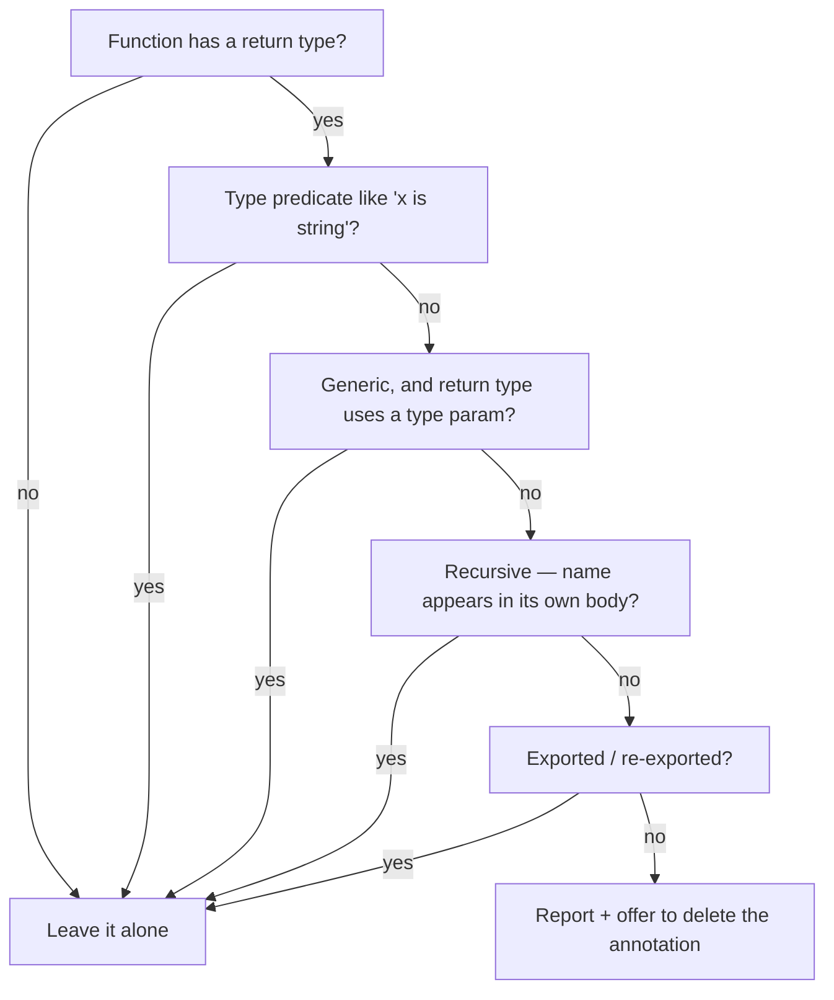

A walkthrough of the custom ESLint rule in
`packages/eslint-config/src/rules/no-inferrable-return-type.ts`.

## The big picture

This file defines a **custom ESLint rule** named `no-inferrable-return-type`. Its job is simple to state:

> If you write a function that is **not exported**, and you put an explicit return type on it (like `: number`), the rule flags it and offers to delete that annotation — because TypeScript can figure the type out on its own.

The reason exported functions get a pass is in the message text on line 177: when TypeScript generates `.d.ts` declaration files, it sometimes *needs* the written-out return type to produce portable output. Internal (non-exported) functions never have that problem, so their annotations are just noise.

So the whole file is machinery for answering one question per function: **"Should I complain about this return type, or is there a good reason to leave it alone?"**

Let me walk through it from the bottom up, because the bottom is where the rule actually lives.

---

## The rule object (lines 114–184)

```ts
export const noInferrableReturnType = createRule({
  create: context => { ... },
  defaultOptions: [],
  meta: { ... },
  name: 'no-inferrable-return-type',
});
```

Every ESLint rule is an object with a few standard parts:

- **`name`** — its identifier.
- **`meta`** (lines 171–182) — metadata. `fixable: 'code'` means ESLint can auto-fix it (with `--fix`). `messages` holds the warning text, referenced later by the id `removeReturnType`. `schema: []` means the rule takes no configuration options. `type: 'suggestion'` classifies it as a style/cleanup rule rather than a bug-catcher.
- **`create`** — the heart. ESLint calls this once per file and expects you to return a set of **handlers**. Each handler is keyed by an AST node type, and ESLint calls it every time it walks over a node of that type.

### What ESLint hands you: the AST

When ESLint reads your source code, it turns it into a tree of objects called an **AST** (Abstract Syntax Tree). Each node describes a piece of syntax — a function, an identifier, a return type, etc. — and has a `.type` field saying what it is, plus a `.parent` pointing back up the tree. This rule spends most of its effort walking around that tree.

### The handlers returned (lines 161–168)

```ts
return {
  ArrowFunctionExpression: checkFunction,
  FunctionDeclaration: checkFunction,
  FunctionExpression: checkFunction,
  Program: program => {
    exportedNames = collectExportedNames(program);
  },
};
```

This says:

- For **every** arrow function (`() => {}`), function declaration (`function foo() {}`), and function expression (`const f = function () {}`), run `checkFunction`.
- For the **`Program`** node (the whole file, visited once at the top), run `collectExportedNames` and stash the result in `exportedNames`.

Note line 116: `let exportedNames` is declared in the closure shared by all handlers. The `Program` handler fills it in, and `checkFunction` reads it later. This is the standard pattern for "gather some file-wide facts first, then use them while checking individual nodes."

The three function-kinds it watches are exactly the type alias at the top:

```ts
type FunctionWithReturnType =
  | TSESTree.ArrowFunctionExpression
  | TSESTree.FunctionDeclaration
  | TSESTree.FunctionExpression;
```

---

## `checkFunction` — the decision procedure (lines 118–159)

This runs for each function and decides whether to report it. It's a series of **early-return "escape hatches"** — each one says "if this special case applies, leave the function alone." If it survives all of them, it gets reported. Let's go through them in order.

```ts
const returnTypeNode = node.returnType;
if (!returnTypeNode) return;
```

**Escape 1: there's no return type annotation at all.** Nothing to remove, so stop. (Most functions exit right here.)

```ts
if (returnTypeNode.typeAnnotation.type === AST_NODE_TYPES.TSTypePredicate) return;
```

**Escape 2: the return type is a type predicate** — something like `function isString(x): x is string`. These cannot be inferred; the `x is string` form is the entire point of writing the function and TypeScript will *not* deduce it for you. So the annotation is mandatory — leave it.

```ts
const typeParamNames = collectTypeParamNames(node);
if (
  typeParamNames.size > 0 &&
  hasMatchingNode(returnTypeNode.typeAnnotation, n => /* return type mentions a type param */)
) {
  return;
}
```

**Escape 3: a generic function whose return type uses one of its own type parameters.** Example:

```ts
function wrap<T>(x: T): T[] { return [x]; }
```

Here the return type `T[]` refers to `T`, the function's type parameter. Removing the annotation can change what TypeScript infers (it might widen or narrow `T` differently), so the rule plays it safe and leaves these alone. We'll see *how* it detects this below.

```ts
const functionName = getFunctionName(node);
if (
  functionName &&
  hasMatchingNode(node.body, n => isIdentifierNamed(n, candidate => candidate === functionName))
) {
  return;
}
```

**Escape 4: a recursive function.** If the function refers to its own name inside its body (i.e., it calls itself), TypeScript *requires* an explicit return type — it cannot infer the type of something defined in terms of itself. So if the function's name appears anywhere in its body, leave the annotation.

```ts
if (isAtModuleBoundary(node, exportedNames)) return;
```

**Escape 5: the function is exported** (directly, or via a re-export at the bottom of the file). This is the main exemption from the rule's description. Details below.

If none of those fired, the annotation is genuinely unnecessary, and we report it:

```ts
const tokenBefore = context.sourceCode.getTokenBefore(returnTypeNode);
context.report({
  ...(tokenBefore && {
    fix: fixer => fixer.removeRange([tokenBefore.range[1], returnTypeNode.range[1]]),
  }),
  messageId: 'removeReturnType',
  node: returnTypeNode,
});
```

**The report + auto-fix.** `returnTypeNode` covers the `: number` part. `getTokenBefore` finds the token just before it — typically the `)` of the parameter list. The fix removes everything from the *end of that token* (`tokenBefore.range[1]`) to the *end of the return type* (`returnTypeNode.range[1]`). In other words, it deletes `: number` cleanly, leaving `)` followed by whatever came after.

Two careful touches here:

- The spread `...(tokenBefore && { fix: ... })` only adds a `fix` property **if** a preceding token was found. If `getTokenBefore` somehow returned nothing, the rule still reports the problem but offers no broken auto-fix.
- `range` values are `[start, end]` character offsets into the source. Using `tokenBefore.range[1]` (end of `)`) as the start means the `)` itself is preserved and only the annotation after it is removed.

---

Now let's go back up and explain each helper that `checkFunction` leans on.

## `getFunctionName` (lines 12–24)

```ts
const getFunctionName = (node: FunctionWithReturnType) => {
  if ((node.type === FunctionDeclaration || node.type === FunctionExpression) && node.id) {
    return node.id.name;
  }
  const parent = node.parent;
  if (parent.type === VariableDeclarator && parent.id.type === Identifier) {
    return parent.id.name;
  }
  return;
};
```

Figures out **what a function is called** — needed for the recursion check (Escape 4). Two ways a function gets a name:

1. **It has its own name node** (`node.id`): `function foo() {}`. Return `"foo"`.
2. **It's assigned to a variable**: `const foo = () => {}`. The arrow function itself is anonymous, but its `.parent` is a `VariableDeclarator` (`foo = ...`), and that declarator's `id` is the identifier `foo`. Return `"foo"`.

If neither applies (a truly anonymous callback, say), it returns `undefined`. That's why Escape 4 starts with `if (functionName && ...)` — no name means no recursion check.

## `childNodes` and `hasMatchingNode` — a generic tree search (lines 26–42)

These two together implement **"search this node and everything inside it for something matching a predicate."**

```ts
const ignoredKeys: ReadonlySet<string> = new Set(['loc', 'parent', 'range']);

const childNodes = (node: object) => {
  const entries = new Map(Object.entries(node));
  const children: object[] = [];
  for (const [key, value] of entries) {
    if (ignoredKeys.has(key)) continue;
    const items = Array.isArray(value) ? value : [value];
    for (const item of items) {
      if (item !== null && typeof item === 'object') children.push(item);
    }
  }
  return children;
};
```

`childNodes` returns the direct child AST nodes of a given node. It does this generically by looking at **every property** of the node object:

- It **skips** `loc`, `parent`, and `range`. Those are metadata, not children — and crucially, `parent` points *upward*, so following it would create an infinite loop.
- For each remaining property, the value might be a single node or an **array** of nodes (e.g. a function body's `statements`). The line `Array.isArray(value) ? value : [value]` normalizes both cases into a list to iterate.
- It keeps only values that are objects and non-null — those are the actual nested AST nodes (strings, numbers, booleans like `name: "foo"` aren't nodes).

```ts
const hasMatchingNode = (node, isMatch): boolean =>
  isMatch(node) || childNodes(node).some(child => hasMatchingNode(child, isMatch));
```

`hasMatchingNode` is a **recursive depth-first search**. "Does `node` match? If not, does any descendant match?" It returns `true` as soon as it finds one. This is the generic engine used by both Escape 3 (does the return type mention a type param?) and Escape 4 (does the body mention the function's name?).

## `isIdentifierNamed` (lines 44–49)

```ts
const isIdentifierNamed = (node, isWanted) =>
  'type' in node &&
  node.type === AST_NODE_TYPES.Identifier &&
  'name' in node &&
  typeof node.name === 'string' &&
  isWanted(node.name);
```

A small predicate: "Is this node an **identifier** (a name reference) whose name passes the `isWanted` test?" The `'type' in node` / `'name' in node` checks are defensive type-narrowing — because `hasMatchingNode` passes around loosely-typed `object`s, this confirms the shape before reading `.name`. Used by Escape 4 (`name === functionName`) and inside Escape 3.

## `collectTypeParamNames` (lines 51–59)

```ts
const collectTypeParamNames = (node) => {
  const names = new Set<string>();
  if (node.typeParameters) {
    for (const param of node.typeParameters.params) {
      names.add(param.name.name);
    }
  }
  return names;
};
```

For a generic function like `function f<T, U>()`, this gathers the set `{ "T", "U" }`. Escape 3 then asks: does the return type reference any of these names? The double `.name.name` is because each type parameter is a node (`TSTypeParameter`) whose `.name` is an identifier node, whose `.name` is the actual string.

Putting Escape 3 together now: it collects `{T, U}`, then searches the return type's AST for a `TSTypeReference` (a place where a type is used by name) whose `typeName` is an identifier in that set. If found → the return type depends on a type parameter → leave it alone.

## The export-detection machinery (lines 61–112)

This whole block answers Escape 5: **"is this function exported?"** There are two distinct ways to export, so there are two detectors.

### `hasExportedAncestor` (lines 75–85) — for inline exports

```ts
const declarationContainers: ReadonlySet = new Set([
  AccessorProperty, ArrayExpression, ClassBody, ClassDeclaration, ClassExpression,
  MethodDefinition, ObjectExpression, Property, PropertyDefinition,
  VariableDeclaration, VariableDeclarator,
]);

const hasExportedAncestor = (node): boolean => {
  const parent = node.parent;
  if (!parent) return false;
  if (parent.type === ExportNamedDeclaration || parent.type === ExportDefaultDeclaration) {
    return true;
  }
  return declarationContainers.has(parent.type) && hasExportedAncestor(parent);
};
```

This walks **up** the tree from the function toward the file root, checking whether it sits under an `export`. It handles cases like:

```ts
export function foo(): number {}              // direct
export const foo = (): number => {}            // inside a VariableDeclaration
export const obj = { method(): number {} }     // nested in an object
export class C { method(): number {} }          // nested in a class
```

The `declarationContainers` set is the list of node types it's willing to **climb through** on the way up. The logic: "If my parent is an export, yes. Otherwise, if my parent is a kind of declaration wrapper (variable, object, class, property, etc.), keep climbing. If my parent is anything else (like a function body or an `if` block), stop — I'm buried inside runtime code, not at an export boundary."

That last point is important: a function declared *inside another function's body* should still be checked (its type can be inferred), so the climb deliberately stops when it hits a non-declaration container.

### `collectExportedNames` + `isReExportedAtTopLevel` — for bottom-of-file exports

The other export style is a separate statement:

```ts
const foo = (): number => {};
export { foo };
```

Here the function isn't *under* an `export` in the tree — the `export { foo }` is a completely separate statement elsewhere. So inline ancestor-walking won't catch it. Instead:

```ts
const collectExportedNames = (program) => {
  const names = new Set<string>();
  for (const statement of program.body) {
    if (statement.type !== ExportNamedDeclaration) continue;
    if (statement.source) continue;
    for (const specifier of statement.specifiers) {
      names.add(specifier.local.name);
    }
  }
  return names;
};
```

Run once at the top (the `Program` handler), this scans every top-level statement for `export { ... }` forms and collects the exported local names into a set. Two filters:

- `if (statement.source) continue;` skips **re-exports from other modules** like `export { x } from './other'` — those don't refer to a function defined in *this* file, so they're irrelevant.
- `specifier.local.name` is the local name (the `foo` in `export { foo as bar }`), which is what matches a function defined in this file.

```ts
const isReExportedAtTopLevel = (node, exportedNames) => {
  if (exportedNames.size === 0) return false;
  if (node.type === FunctionDeclaration) {
    return node.parent.type === Program && node.id !== null && exportedNames.has(node.id.name);
  }
  const declarator = node.parent;
  if (declarator.type !== VariableDeclarator || declarator.id.type !== Identifier) return false;
  return declarator.parent.parent.type === Program && exportedNames.has(declarator.id.name);
};
```

This checks whether *this specific function* is one of those bottom-exported names. It insists the function is genuinely **top-level**, not just same-named as something exported:

- For a `function foo() {}`: its parent must be the `Program` (top level), it must have a name, and that name must be in `exportedNames`.
- For `const foo = () => {}`: walk to the `VariableDeclarator` (`foo = ...`), then up two more levels (`VariableDeclarator → VariableDeclaration → Program`) to confirm it's a top-level `const`, and check the name is exported.

The `declarator.parent.parent` chain is exactly: declarator → the `const` declaration → the program. Requiring `Program` there prevents a nested helper that happens to share a name with an exported symbol from being wrongly exempted.

### `isAtModuleBoundary` (lines 99–100)

```ts
const isAtModuleBoundary = (node, exportedNames) =>
  hasExportedAncestor(node) || isReExportedAtTopLevel(node, exportedNames);
```

Just combines the two detectors: a function is "at the module boundary" if it's exported inline **or** re-exported at the bottom. Either way, Escape 5 fires and the annotation is kept.

---

## How it all fits — one pass over a function

When ESLint hits a function, `checkFunction` asks, in order:



Each "keep" is a real TypeScript constraint where the annotation is either **required** (predicate, recursion) or **safer to keep** (generic returns, exports for `.d.ts` portability). Everything else is an annotation TypeScript could have inferred — so the rule removes the clutter.

---

## A couple of design notes worth appreciating

- **The generic tree walk (`childNodes`/`hasMatchingNode`)** is deliberately not hand-tuned to specific node shapes. Rather than know exactly where type-parameter references or recursive calls can appear, it just searches the whole subtree. That's slower but far more robust — it can't be defeated by some unusual nesting the author didn't anticipate. The `ignoredKeys` set (especially skipping `parent`) is what keeps that walk from looping forever.

- **The two-phase approach** (`Program` handler runs first to build `exportedNames`, then per-function checks use it) exists purely because bottom-of-file `export { foo }` statements may appear *after* the function in source order. You can't know a function is exported that way until you've seen the whole file, so the rule collects that fact up front.
