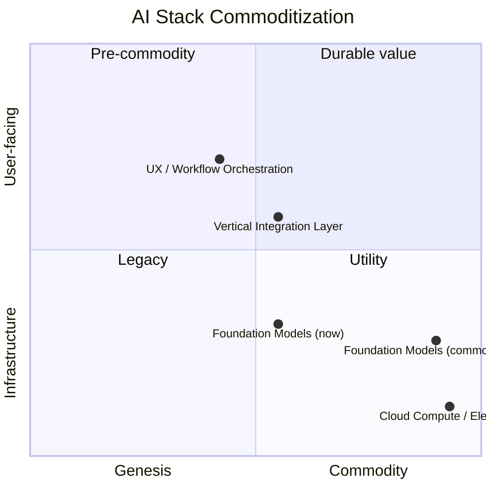
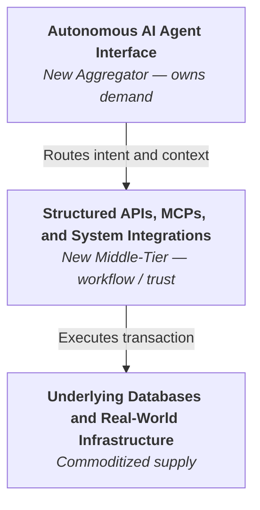
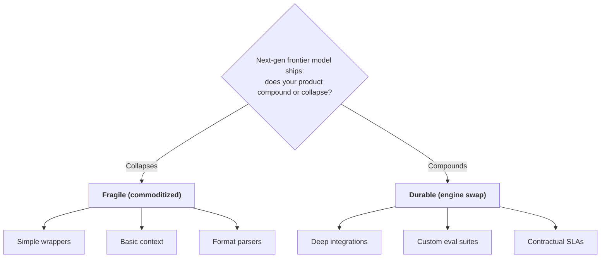
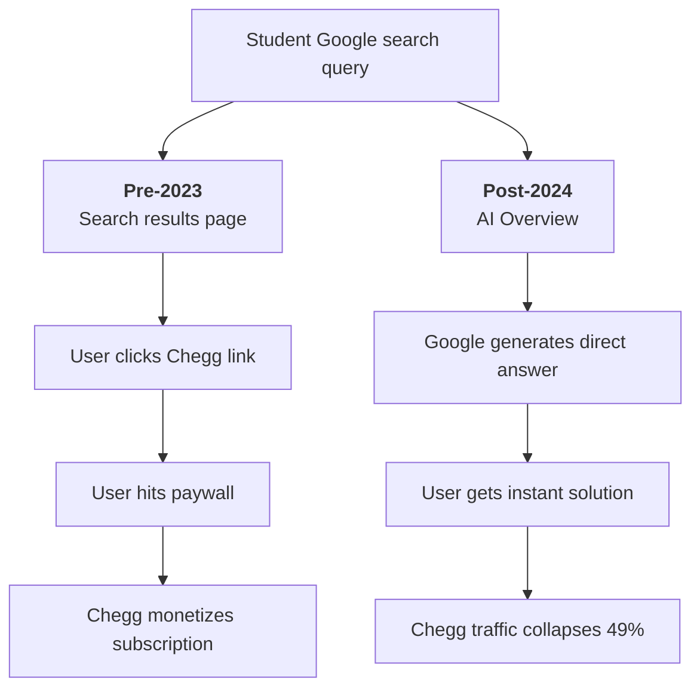
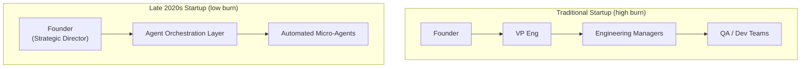
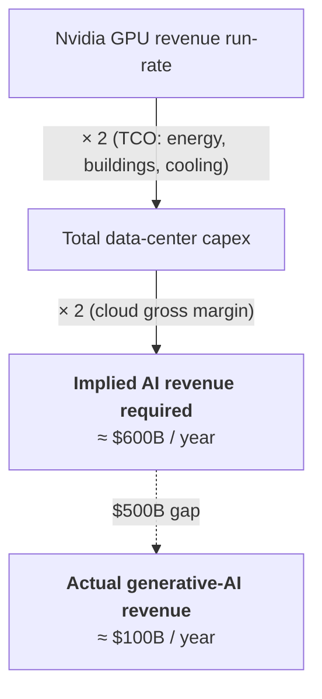
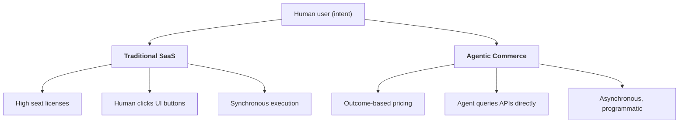

# New Working Backwards - Startup Philosophy for the Late 2020

## 1. The Structural Shift Underneath the Noise

The dramatic realignment of the technology ecosystem between late 2022 and 2026 represents more than a collection of isolated corporate displacements; it marks a fundamental phase change in the computational substrate of the global economy[^1]. Historically, the primary constraint on digital innovation was the human labor cost required to translate human intent into deterministic, instruction-level code[^1]. Under that regime, software development was a capital-intensive asset class with high structural barriers to entry[^2]. The late 2020s are defined by the total collapse of these barriers, as software has transitioned from a high-fixed-cost asset into a zero-marginal-cost utility[^1].  
This structural transformation is best understood through the architectural taxonomy articulated by Andrej Karpathy[^4].

* **Software 1.0** represents classical deterministic programming, where human engineers write explicit instructions ($X \to Y$) to cover every anticipated edge condition[^4].  
* **Software 2.0** emerged with deep learning, where human programmers define a neural network architecture and a loss function, leaving backpropagation to compile the weights from training data[^4].  
* **Software 3.0** represents the natural language programming era[^6]. Here, foundation models act as pre-compiled cognitive engines[^7]. The source code is written in natural language prompts, and the execution engine is a token-prediction loop[^6].

The transition to Software 3.0 means that traditional software components are continuously refactored into prompts and context-orchestration layers, collapsing the time and capital required to build complex applications[^7].  
This trajectory is the logical realization of Richard Sutton’s *Bitter Lesson*[^9]. Sutton observed that seventy years of artificial intelligence research confirms that general-purpose methods leveraging computation—specifically search and learning—consistently outperform handcrafted human heuristics[^9].  
Throughout history, researchers who attempted to build domain-specific rules or human cognitive structures into their systems achieved short-term improvements but ultimately plateaued[^11]. These systems were systematically bypassed once raw compute scaled[^9].  
The chess engine Deep Blue bypassed complex grandmaster heuristics via brute-force alpha-beta search[^9]; Hidden Markov Models outperformed handcrafted 1970s speech rules[^9]; and Convolutional Neural Networks replaced hand-encoded edge detection algorithms like SIFT[^9].  
In the late 2020s, this lesson has migrated from the research lab to the corporate balance sheet[^1]. The engineering-heavy pipelines that defined the first generation of SaaS are now being replaced by general-purpose foundation models running on massive compute clusters[^1].  
The economic drivers of this shift are governed by empirical scaling laws[^13]. Since 2020, training compute for frontier language models has grown at 5× per year, while pre-training compute efficiency has improved by 3× per year[^14]. The cost to run inference on these models at a fixed level of performance has plummeted by approximately two orders of magnitude annually, halving every two months[^14].

| AI Parameter / Metric | Annual Growth / Progress Rate | Doubling / Halving Time | OOMs per Year |
| :---- | :---- | :---- | :---- |
| **Frontier Model Training Compute** | 5.0× increase / year | 5.2 months | 0.70 |
| **Pre-Training Compute Efficiency** | 3.0× improvement / year | 7.6 months | 0.50 |
| **Global AI Computing Capacity** | 3.4× increase / year | 6.8 months | 0.53 |
| **AI Chip Performance per Dollar** | 1.37× improvement / year | 2.2 years | 0.14 |
| **LLM Inference Prices (Fixed Perf)** | 40× to 900× decrease / year | 2.0 months | 2.00 |

This pricing collapse was further accelerated by the introduction of highly sparse architectures[^16]. DeepSeek-R1 and its predecessor V3 demonstrated that reasoning-capable models could be trained at a fraction of Western capital projections[^13]. By using an optimized Mixture-of-Experts (MoE) sparsity ratio, the final training run of DeepSeek-V3 consumed only 2.788 million GPU hours[^17]. At a theoretical rental price of $2 per GPU hour for H800 chips, the core training compute cost was approximately $5.57 million[^17].  
While this figure excludes the substantial capital required for hardware stockpiles, personnel, and thousands of prior ablation experiments, it proved that top-tier model training could be democratized[^17]. Epoch AI’s financial data confirms this dynamic: final training runs account for a minority of total R\&D compute expenditures, representing only 9.6% of OpenAI’s, 22.6% of MiniMax's, and 12.3% of Z.ai's total compute budgets[^18].  
The microeconomic reality of this capability scaling was documented by Erik Brynjolfsson, Danielle Li, and Lindsey Raymond[^19]. In their NBER study of 5,179 customer support agents, access to a generative AI conversational assistant increased productivity by 14% on average[^19]. Crucially, the technology demonstrated strong skill-flattening characteristics: novice and low-skilled workers saw a 34% improvement, whereas highly skilled, experienced workers saw minimal impact[^19]. The tool effectively captured the tacit knowledge of top-performing employees and disseminated it down the experience curve[^19].  
Subsequent field experiments in 2025 demonstrated that knowledge workers integrated with office copilots spent 31% less time on email weekly, saving an average of 3.6 hours that could be reallocated to independent work[^21].  
However, Daron Acemoglu provides a critical macroeconomic counterweight to this optimism[^22]. In "The Simple Macroeconomics of AI," Acemoglu argues that as long as AI's microeconomic effects are driven by cost savings at the task level, its aggregate macroeconomic consequences are strictly bound by a version of Hulten's theorem[^22]. Under this framework, aggregate productivity gains are determined by the fraction of tasks impacted multiplied by the average cost savings at the task level[^23].  
Using current estimates of AI exposure, Acemoglu projects a modest increase of at most 0.66% in Total Factor Productivity (TFP) over ten years[^22]. The core bottleneck is that while "easy-to-learn" tasks (such as customer support routing and basic documentation writing) are easily automated, "hard-to-learn" tasks—which are highly dependent on context, tacit environment variables, and unobjective metrics—resist pure automation[^23].  
To reconcile these signals, founders must view this shift through Carlota Perez’s framework of technological revolutions[^24]. Every paradigm-defining wave—from steam and railways to microelectronics—is divided into an **Installation Period** and a **Deployment Period**, separated by a turbulent **Turning Point**[^24].

* **The Installation Period** (comprising *Irruption* and *Frenzy*) is characterized by speculative capital, financial mania, and the rapid over-building of foundational infrastructure[^3]. This was the GPU stockpiling era of 2022–2025, where capital allocation was decoupled from actual commercial revenue[^3].  
* **The Turning Point** is a period of institutional friction, financial readjustment, and structural layoffs as the market demands actual returns on infrastructure investments[^1].  
* **The Deployment Period** (comprising *Synergy* and *Maturity*) begins when cheap, commoditized utility-layer infrastructure is integrated into the productive fabric of the real economy, rejuvenating legacy verticals through business model redesign[^25].

The late 2020s represent the transition through this Turning Point[^3]. The defining structural shift is that **durable value has decoupled from software production and relocated to workflow orchestration, integration, and delegated trust**[^2].

## 2. What Loads, Bends, and Breaks in the Problem-First Tradition

As the underlying substrate transitions, founders must critically re-evaluate which components of the classical startup canon remain viable, which must adapt, and which are entirely broken[^2].

### What of the Older Tradition Still Loads

The core of the problem-first tradition remains the necessary foundation for building a durable business, precisely because human-centric constraints are non-commoditizable[^7].

* **Jobs-to-be-Done (JTBD)**: Clayton Christensen’s principle that customers "hire" products to make progress in specific life situations remains the ultimate anchor[^30]. While the technological mechanism hired to do the job may transition from a human-operated Software 1.0 dashboard to an autonomous Software 3.0 agent, the fundamental human job (e.g., qualifying a lead, reconciling an insurance claim, verifying legal compliance) does not change[^7].  
* **The Mom Test**: Rob Fitzpatrick’s directive to focus user interviews exclusively on specific past behaviors rather than hypothetical future preferences is more critical than ever[^32]. Because model capabilities arrive faster than users can conceptualize them, asking customers what features they want yields useless speculative noise[^32]. Founders must listen for "hair-on-fire" problems—frequent, painful, and costly enough that the customer is already trying to solve them, however crudely[^30].  
* **Founder-Market Fit**: When the marginal cost of code generation approaches zero, execution speed is commoditized[^2]. Consequently, founder-market fit is elevated from an advantage to an absolute prerequisite[^7]. A startup's value is driven by human factors that AI cannot replicate: deep domain taste, tacit vertical insight, and earned relational trust[^5]. A founder with decades of earned trust in a highly specialized, regulated industry can build and distribute solutions that a generalist software engineer using a frontier model cannot access[^8].

### What of the Older Tradition Bends or Breaks

The classic assumption that product validation must follow a strictly linear sequence—first identifying a problem, then specifying and building a solution—breaks down under late 2020s conditions[^23].  
Historically, Steve Jobs's WWDC 1997 comment that "you've got to start with the customer experience and work backwards to the technology" assumed that technological capabilities were static during the design cycle[^1]. Today, capabilities arrive faster than users can articulate problems for them[^23].  
ChatGPT itself is the canonical example of this breakdown: it was released by OpenAI as a low-expectation research preview, and its massive product-market fit was discovered post-facto by users who mapped its emergent capabilities to their daily workflows[^23].  
This dynamic creates a structural tension between **capability-push** and **market-pull**. In the current regime, capability-push is legitimate when a founder identifies an emergent, non-obvious capability (e.g., multi-file reasoning, multi-agent orchestration, or zero-shot logical planning) and applies it to a structural cost that the customer had previously accepted as a permanent cost of doing business[^8].  
The seam between legitimate capability-push and the classic "technology in search of a problem" trap lies in the *substitution of cognitive labor*[^37]. If the technology merely automates a trivial, non-consequential task that requires constant, high-friction human verification, it is a wrapper destined for depreciation[^38]. If it assumes complete cognitive responsibility for a high-stakes, multi-step workflow with defined economic output, it represents a genuine transformation of the value chain[^29].

## 3. The New Defensibility Map: Helmer and Thompson Re-Evaluated

Defensibility in the software era historically relied on code complexity, data accumulation, and distribution control[^5]. In the late 2020s, these barriers have eroded[^2]. Founders must re-map defensibility using Hamilton Helmer’s *7 Powers* and Ben Thompson’s *Aggregation Theory*[^42].

### Helmer’s 7 Powers in the AI Stack

Each of Helmer’s classical powers behaves differently when the core computational substrate is owned, maintained, and updated on a quarterly cadence by external frontier labs[^2].

* **Scale Economies (Weak)**: While the capital required to train frontier models is massive, these models commoditize rapidly[^2]. For application and workflow developers, scale economies in pure computing cost are weak, as GPU pricing is competed down to marginal cost by competing clouds[^1].  
* **Network Economies (Moderate)**: Classic data flywheels—where more users generate more data to train better models—are weaker than anticipated[^2]. High-performance open-weights models and synthetic data generation consistently bypass custom, user-accumulated datasets[^2]. However, network effects remain viable when built around **taste and workflow standardizations**[^7].  
* **Counter-Positioning (Strong)**: Startups can leverage counter-positioning by deploying pure agentic automation and outcome-based pricing models[^29]. Incumbent software giants, whose business models are built on seat-based SaaS licenses, cannot adopt these pricing models without cannibalizing their existing revenue streams[^29].  
* **Switching Costs (Very Strong)**: Deep integration into an enterprise’s systems of record, custom evaluation pipelines, and multi-system orchestration layers create high structural friction[^29]. Once an agent is deeply embedded in executing complex operational workflows, the cost and operational risk of replacing it are prohibitive[^29].  
* **Branding (Very Strong)**: In an era of autonomous execution, trust is the ultimate premium[^29]. A brand that represents security, auditability, strict policy compliance, and liability protection becomes highly defensible when enterprises delegate actual decision-making authority[^29].  
* **Cornered Resource (Weak)**: Human talent is highly mobile, and reverse acqui-hires have demonstrated that even elite research teams can be absorbed overnight by scale players[^34]. Proprietary datasets are frequently bypassable, legally contested, or structurally deprecated by model updates[^47].  
* **Process Power (Moderate)**: Extreme velocity, continuous integration of emerging models, and the creation of proprietary, domain-specific evaluation suites represent a viable operational moat[^36].

### Simon Wardley's Mapping of the Commoditization Pipeline

Simon Wardley’s mapping framework plots business components along a horizontal axis of evolution (Genesis, Custom-Build, Product, Commodity) and a vertical axis of user visibility[^50].

*Where does durable value capture sit as foundation models commoditize?*

Foundation models have rapidly migrated from Genesis (2022) to custom-built products, and are now operating as a highly standardized, utility-like commodity layer on the far-right of the map[^7]. They function like electricity in the 20th century: essential, ubiquitous, and metered[^1].  
Durable value capture is forced upward to the visible layer (User Experience and Workflow Orchestration) and downward to highly specialized integration channels[^2].

### Thompson’s Aggregation Theory Updated for AI Distribution

Ben Thompson’s Aggregation Theory historically explained how internet platforms achieved dominance by eliminating distribution costs and aggregating demand, forcing supply to self-integrate on the aggregator's terms[^41].  
In the late 2020s, LLM interfaces represent the new front-end of the internet[^5]. The aggregation point has shifted from search engines and social feeds to reasoning-capable dialogue systems[^5]. When users begin and end their journeys inside an autonomous agent, the traditional conversion funnels of SaaS and e-commerce are siphoned into the AI layer[^5].  
The primary strategic challenge is no longer merely dominating SEO or performance marketing; it is ensuring that your service is highly discoverable, structured, and trusted by the agents making purchasing decisions on the user's behalf[^5]. This is a transition from "content is king" to "content is context"[^5].

*What does the AI-era aggregation stack look like?*

Durable advantage lives at the intersection of **the workflow layer** and **the trust/brand layer**[^2]. If a business operates primarily at the model layer, it faces brutal margin compression[^2]. If it operates at the distribution layer without proprietary workflow integration, it is vulnerable to disintermediation by the platform owners[^2].

## 4. The Strategic Option Set

To navigate this landscape, founders must choose a clear strategic path and apply rigorous heuristics to ensure their business is designed to survive the continuous improvement of foundational models[^2].

### Option A: Build on Top of Frontier Models

This path involves constructing deep, specialized workflow applications that leverage the cognitive capabilities of frontier APIs[^5].

* **The Mechanics**: Startups like Cursor, Perplexity, Sierra, and Harvey operate in this quadrant[^29]. Cursor achieved massive scale by wrapping an IDE around model APIs, focusing on extreme shipping velocity, proprietary context-retrieval mechanisms, and multi-file code editing via its Composer architecture[^36]. Sierra built an Agent OS that orchestrates high-stakes enterprise customer service workflows by integrating directly with back-end systems of record[^29].  
* **Viability Conditions**: The startup must ship product iterations faster than the underlying model APIs add native features[^36]. It must focus heavily on proprietary context-engineering, specialized user interfaces, and custom evaluation loops[^8].  
* **The Trap**: If the product's value proposition is easily reproduced by a general-purpose model with a larger context window or native logical planning, the next model release from a frontier lab will commoditize the business overnight[^2].

### Option B: Train Your Own Model

This path involves developing and training proprietary architectures from scratch or fine-tuning open weights on exclusive data[^16].

* **The Mechanics**: This strategy is illustrated by BloombergGPT’s domain-specific financial training, or DeepSeek’s highly efficient sparse Mixture-of-Experts (MoE) optimizations[^16].  
* **Viability Conditions**: This is almost never the correct call for a startup due to massive capital depreciation and the extreme velocity of general-purpose model scaling[^1]. It is viable only if the domain has strict, non-negotiable regulatory or security requirements that prohibit cloud API routing, or if the startup possesses a truly exclusive, non-public dataset that cannot be bypassed or synthesized[^16].  
* **The Trap**: The "generalization leap." A general-purpose frontier model with 10× more compute will consistently out-reason a specialized model on domain-specific tasks, rendering the startup's massive training expenditure redundant[^9].

### Option C: Own a Deep Vertical Workflow

This path involves targeting highly regulated, domain-deep, or operationally complex industries (e.g., healthcare billing, insurance claims, public sector procurement, maritime logistics)[^29].

* **The Mechanics**: Startups like Harvey (legal), Decagon (customer experience), and Hebbia (finance) construct highly customized, multi-agent systems integrated deeply into legacy databases[^29].  
* **Viability Conditions**: The vertical must require complex, multi-system orchestration, strict policy guardrails, and auditability[^29]. The startup must offer outcome-based pricing models and assume actual execution liability by guaranteeing contractual SLAs[^29].  
* **The Trap**: High consultative service overhead. If the startup requires extensive custom engineering for every new client integration, it risks transitioning from a highly scalable software business into an expensive IT consulting firm[^40].

### Option D: Own Distribution

This path relies on embedding AI features into a massive, pre-existing, and active user footprint[^54].

* **The Mechanics**: This is the core strategy of incumbents like Microsoft (Office 365 Copilot), Salesforce (Agentforce), and Aaron Levie’s position at Box[^36].  
* **Viability Conditions**: The incumbent must own the direct relationship with the enterprise user and control the primary interface where work is executed[^43].  
* **The Trap**: Startups attempting this path from scratch face a cold-start problem[^43]. Competing head-on with incumbents on distribution is a losing strategy; startups must instead counter-position by offering deep, verticalized orchestration that the incumbent's general-purpose features cannot match[^29].

## 5. The Capability-Ratchet Problem and Heuristic Testing

The defining operational challenge of the late 2020s is the **capability-ratchet**—the constant risk that next quarter’s model release from OpenAI, Anthropic, Google, or an open weights release will turn a startup's core technological differentiator into a free, out-of-the-box feature[^2].  
To survive this continuous escalation, serious founders utilize five explicit, operational tests[^2].

*What separates products that survive the next model release from those that don't?*

### Test 1: The GPT-N+1 Test

*The core question: If the underlying model becomes N times better, does the product's value compound or collapse?* 2  
If a startup’s value proposition is solving a problem that is simply a temporary limitation of current models (e.g., basic code formatting, simple translation, basic PDF parsing), the product will not survive the model-release cycle[^2]. If the startup builds deep workflow tools, the next-generation model acts as a cheaper, faster engine that improves the startup's gross margins and capability boundaries[^29].

### Test 2: The Autonomous Agent Test

*The core question: What value does an autonomous agent fail to replicate?* 29  
An agent can write code, generate text, and run automated API scripts[^5]. It cannot negotiate a complex commercial contract between two human entities, establish a high-trust relational bond, or navigate the political dynamics of enterprise procurement[^29].  
Durable startups do not compete on simple generation; they compete on orchestration, verification, and governance[^6].

### Test 3: The Compounding Flywheel Test

*The core question: Does the product’s usage generate non-reproducible defensibility?* 7  
Founders must design loops where usage directly improves defensibility:

* **The Taste Flywheel**: User edits and workflow preferences train a highly localized, specialized context layer that makes the UX feel hyper-customized[^8].  
* **The Integration Flywheel**: The product continuously syncs with more systems of record, creating a dense web of dependencies that are highly painful to remove[^29].

### Test 4: The Trust and Delegation Test

*The core question: Would an enterprise buyer delegate real-world financial or legal liability to this system?* 29  
An enterprise buyer will comfortably use AI to generate internal emails[^56]. They will hesitate before letting an AI autonomously issue a $10,000 refund, rewrite an insurance policy, or edit clinical notes in a hospital[^29].  
Startups operating in high-stakes environments must design "human-in-the-loop" verification interfaces, policy-based guardrails, and contractual SLAs[^29]. Defensibility is built by taking liability off the customer's plate[^29].

### Test 5: Eval-Driven Development over Spec Docs

In Software 1.0, product managers wrote detailed specification documents, and engineers built against those rigid specs[^4]. In Software 3.0, because model outputs are probabilistic, founders must replace specs with robust **evaluation suites**[^6].  
A feature is defined by a matrix of prompts, expected outputs, and automatic grading criteria[^40]. Development is a continuous optimization loop, where code changes are validated against thousands of synthetic and real-world execution tests to ensure accuracy, safety, and brand alignment[^40].

## 6. The Graveyard: Lessons from Corporate Demise

The transition through the Turning Point has left a dense graveyard of highly funded startups[^3]. Each failure yields a specific strategic lesson[^47].

### Jasper AI: The Commoditization of the Raw API Wrapper

* **The Lesson**: A workflow that sits entirely on top of a single API without proprietary context or system-of-record integration cannot maintain pricing power[^2].  
* **The Mechanics**: Jasper scaled rapidly by offering marketing copy generation built on early OpenAI models[^35]. However, once foundational models introduced native instruction-following, longer context windows, and competitive writing capabilities directly into their consumer interfaces, Jasper’s value proposition collapsed[^2]. The company lacked a proprietary distribution channel, specialized data, or deep system-of-record integration[^2].

### Inflection AI & Character.ai: The Unit Economics of Scale

* **The Lesson**: Building consumer-facing models without a highly differentiated monetization model or low-cost distribution channel is financially unsustainable[^2].  
* **The Mechanics**: Inflection raised $1.3 billion to build Pi, a highly empathetic personal companion[^57]. Character.ai raised hundreds of millions, achieving massive user engagement[^48]. However, both faced a double-bind: the capital requirements to train competitive frontier models were escalating exponentially, while consumer willingness to pay remained low compared to the costs of GPU inference[^2].

This economic pressure led to the "reverse acqui-hire" or "Hire-and-License-Out" (HALO) structure[^34].  
Microsoft paid Inflection $650 million—$620 million for a non-exclusive technology license and $30 million to waive legal rights—while hiring co-founders Mustafa Suleyman and Karén Simonyan along with nearly the entire 70-person team[^34].  
Google executed a parallel transaction with Character.ai in August 2024, paying approximately $2.7 billion to re-hire co-founders Noam Shazeer and Daniel De Freitas, licensing the technology, and leaving the consumer service to run as an independent entity that abandoned its own frontier model training[^34].  
These transactions allowed Big Tech platforms to consolidate elite talent and IP while avoiding formal Hart-Scott-Rodino antitrust merger reviews[^34].

### Stack Overflow: The Erosion of the Knowledge Intermediary

* **The Lesson**: Platforms that monetize human-to-human knowledge retrieval are quickly bypassed when users can retrieve personalized, interactive answers directly inside the IDE[^36].  
* **The Mechanics**: Stack Overflow’s business model was built on community-driven Q\&A indexable by search engines[^47]. When LLMs integrated directly into development environments (e.g., GitHub Copilot, Cursor), developers stopped searching the open web for documentation or troubleshooting guides, leading to a rapid collapse in traffic and community engagement[^47].

### Chegg: The Demise of the Static Content Moat

* **The Lesson**: Organic search discovery is highly vulnerable when search engines transition to AI-generated direct answers, and paid content libraries are easily replicated by reasoning engines[^47].  
* **The Mechanics**: Chegg’s market capitalization collapsed by 99% in 39 months, falling from a peak of $14.5 billion in February 2021 to approximately $125 million in May 2026\[^58]. The company faced a two-front assault 58:  
  1. **ChatGPT** made its core $19.95 monthly subscription redundant by offering instant, free, interactive step-by-step homework help[^47].  
  2. **Google AI Overviews** destroyed its top-of-funnel discovery[^47]. Instead of students clicking through search results to Chegg’s paywalled answer database, Google generated the answers directly on the search results page, causing organic non-subscriber traffic to collapse[^47].

Chegg laid off 22% of its workforce in May 2025 and an additional 45% in October 2025, serving as a stark warning for any business that operates primarily as a middleman between a user's question and a static database of answers[^47].

*How did Google AI Overviews collapse Chegg's discovery funnel?*

### Stability AI: The Liquidity Crisis of open-weights Pioneers

* **The Lesson**: Open-weights model release strategy must be supported by a highly disciplined capital structure and a clear enterprise monetization layer, otherwise the company is merely funding research for competitors[^16].  
* **The Mechanics**: Stability AI achieved massive global cultural impact with Stable Diffusion, but burned through capital rapidly without establishing a sustainable, high-margin revenue model[^48]. It faced financial distress, governance struggles, and leadership shakeups as the market turned away from speculative, revenue-free training plays[^48].

### Codecademy & Paid-Tutorial Market: The Collapse of Static Curriculum

* **The Lesson**: When students have access to highly personalized, real-time AI tutors integrated directly into their development environments, the willingness to pay for pre-recorded, static video courses collapses to zero[^47].  
* **The Mechanics**: The business model of charging subscription fees for curated learning paths was structurally undermined by natural-language IDEs[^36]. The interactive assistant provides immediate context-dependent assistance, rendering standard curriculum platforms redundant[^47].

## 7. Organizational, Capital, and Labor Realignments

The transition to Software 3.0 has permanently altered the operational architecture of startup organizations, the profile of talent required, and the capital efficiency of company building[^6].

### The Re-Shaped Product Team

The roles within a late 2020s startup have transformed:

* **PM-as-Builder**: The traditional product manager who merely writes Jira tickets is obsolete[^6]. PMs now use natural language editors, natural-language IDEs, and multi-file code generators to build functional MVPs directly, dramatically compressing the path from customer feedback to production code[^6].  
* **Design-as-Eval-Author**: Product designers no longer merely draw static mockups in Figma[^40]. They are responsible for designing the interaction flow, the conversational tone, and the guardrails of the AI agent[^40]. They author the evaluation criteria that determine whether an agent's behavioral output matches the brand's voice and customer expectation[^40].  
* **The Disappearance of Intermediate Roles**: Classical QA testing, basic system administration, and Tier-1 customer support are almost entirely automated[^8]. Product teams are small, highly technical, and focused on system architecture, security orchestration, and continuous eval monitoring[^8].

### The Scale of the Solo and Skunkworks Unicorn

In 2024, Sam Altman predicted the emergence of the first "one-person billion-dollar company," enabled by multi-agent orchestration and cognitive leverage[^8]. While a literal zero-employee unicorn remains rare, the capital-to-headcount ratio has permanently altered[^8].  
Midjourney represents the closest structural model: it scaled to a reported $200 million in annual revenue with a team of approximately 11 full-time employees, yielding over $18 million in revenue per employee[^8]. Similarly, indie developer Pieter Levels manages a portfolio of highly successful global web applications generating over $3 million in annual recurring revenue as a completely solo operator[^8].  
This leverage is enabled by a shift from **prompt engineering** to **context engineering**[^8]. Instead of writing isolated prompts, lean teams architect entire information ecosystems—utilizing Model Context Protocol (MCP) servers, semantic databases, and self-correcting agent loops—allowing a single strategic operator to direct an automated workforce[^5].

*How does the late 2020s startup org compress relative to a traditional one?*

Traditional startups spend 70% to 80% of their venture capital on engineering payroll. Under the new regime, a small team replaces massive engineering cohorts with a highly integrated suite of AI agent subscriptions and metered API usage[^8]. This increases capital efficiency by 10× to 50×, allowing startups to achieve profitability with minimal dilutive funding[^8].

### Anthropic Economic Index Data on Task Composition

The shift in cognitive labor is visible in real-time usage metrics[^63]. The March 2026 Anthropic Economic Index report highlights how professional workflows have evolved 63:

* **Coding Migration**: Software engineering remains the dominant task category on Claude, with computer and mathematical roles accounting for 35% of all traffic[^63]. However, coding has rapidly migrated from manual, chat-based interfaces (Claude.ai) to automated, agentic API environments[^63].  
* **Task Diversification**: Paid enterprise usage is highly concentrated, with the top 10 most common tasks accounting for 19% of traffic[^63]. A notable shift is occurring in back-office business operations: administrative tasks (such as document formatting and data manipulation) and management activities (analytical preparation, drafting customer communications) have surged to 13% and 5% respectively[^63].  
* **Emergent API Automations**: First-party API traffic is increasingly dominated by three programmatic patterns: automated customer service (refund verification, payment processing), B2B outreach enablement (lead qualification, cold-email generation), and automated market operations[^63].  
* **Observed Exposure vs. Theoretical Capability**: In highly exposed fields like computer programming, observed exposure (actual automated usage) has reached 75% coverage of theoretically automatable tasks[^65]. For customer service and data entry, coverage sits at 67%[^65].  
* **Labor Displacement Patterns**: While aggregate unemployment has not spiked, the job-finding rate for younger workers (aged 22–25) in highly exposed cognitive professions has declined by 14% since 2022, signaling a structural contraction in entry-level hiring[^65].

## 8. The Critique, Counter-Trends, and the Bubble Case

An honest strategic assessment must look past immediate market excitement to analyze capital allocation, infrastructure bottlenecks, and emerging geopolitical constraints[^1].

### The $600 Billion Question and Capital Depreciation

In June 2024, Sequoia Capital’s David Cahn updated his analysis of the massive capital expenditure gap in the AI ecosystem, articulating what he termed the "$600 Billion Question"[^1]. Cahn’s core formula calculates the total implied revenue needed to support the massive industry build-out of data centers, fiber, and energy infrastructure 27:

$$\text{Total Implied Revenue Needed} = \text{Nvidia’s Run-Rate Revenue Forecast} \times 2 \times 2$$

* **The First 2x Multiplier** accounts for the Total Cost of Ownership (TCO) of the data center[^27]. GPUs represent only half of the capital expenditures; the other half consists of energy grid connections, specialized buildings, liquid cooling, and backup generators[^27].  
* **The Second 2x Multiplier** accounts for a standard 50% gross margin for the end cloud buyer (e.g., startups, enterprises, or hyperscalers renting compute) who must also generate profit[^27].

Applying this formula, Cahn discovered a massive discrepancy[^27]. While Nvidia’s run-rate implied that the market required $600 billion in annual revenue to break even, the actual revenue generated by generative AI applications stood at approximately $100 billion, leaving a **$500 billion revenue gap**[^2].

*How is the $500B AI revenue gap calculated?*

This structural over-building has critical implications for startups[^27]. First, **rapid hardware depreciation** is a constant threat to capital[^1]. A stockpiled H100 cluster depreciates rapidly once chips like the B100 enter the market, offering 2.5× better performance for only 25% more cost[^27].  
Second, because cloud hyperscalers are engaged in a game-theoretic race to build capacity, **GPU compute prices will be competed down to marginal cost**[^1]. This structural deflation is highly beneficial for startups, which get access to increasingly powerful computational power at declining prices[^27].  
However, it is highly destructive for investors who fund pure infrastructure wrappers or static capital-intensive training runs[^2].

### Open-Weights Deflation and Regulatory Realignment

The rapid rise of high-performance open-weights models (e.g., Meta’s Llama series, Mistral, Qwen, and DeepSeek) acts as a powerful deflationary force on proprietary-model pricing[^16]. Startups no longer need to pay rent to a single closed-API provider[^16]. They can run highly optimized, open models on private cloud infrastructure or local edge devices, protecting user privacy and securing data residency[^16].  
Simultaneously, the regulatory landscape has become a major driver of startup strategy:

* **The EU AI Act** and sectoral rules in healthcare, finance, and defense impose strict transparency, auditability, and data-residency mandates.  
* **Privacy-as-a-Moat**: In regulated geographies, the ability to guarantee that customer data never leaves a local network or a sovereign cloud is a powerful competitive advantage[^16]. Startups that design their architectures around highly secure, localized open-weights models can bypass the security objections that block closed-API competitors in the enterprise market[^16].

### Counter-Trends: The Premium of the Human Touch

As synthetic content, automated emails, and conversational voice agents saturate the digital landscape, a powerful counter-trend is emerging: **the commoditization of digital noise**[^5]. When a highly polished marketing email or a flawless cold call can be generated for a fraction of a cent, the economic value of these interactions drops[^5].  
A premium is placing on authentic human interaction, physical co-location, and craft-level execution[^39]. Companies like Basecamp and 37signals advocate for a return to highly focused, hand-crafted software that rejects the hyper-automated, AI-everything narrative[^66]. Durable brand value in the consumer space will increasingly align with verified physical origin, human storytelling, and community-driven trust[^39].

## 9. The Psychology of Building under Capability Uncertainty

Operating a startup in the late 2020s requires navigating extreme, ongoing cognitive dissonance[^1]. Founders frequently default to one of two psychological traps:

* **Reflexive AI Maximalism**: The belief that AGI is arriving immediately, leading to a total abandonment of classical product discipline, customer discovery, and engineering rigor in favor of pure speculative hype[^27].  
* **Reflexive AI Denial**: The belief that foundation models are merely a temporary, over-hyped trend, leading to a stubborn refusal to integrate automated cognitive steps into traditional software pipelines[^1].

The most successful builders avoid both extremes by applying the **Stockdale Paradox** to the AI timeline 1:  
![Stockdale Paradox diagram][image3]  
They maintain unwavering faith that the AI shift represents a structural realignment of the economy, while simultaneously confronting the brutal facts of their immediate operational reality—namely, that their current codebase is depreciating rapidly, model APIs are unstable, and customers care about reliable, audit-ready solutions rather than model novelty[^1].  
The defining operational discipline is **staying problem-curious rather than capability-obsessed**[^2]. When a new model drops, the natural inclination is to rebuild the product around the latest exciting feature[^2]. The disciplined founder resists this temptation, remaining focused on the core workflow bottlenecks of the user[^2]. They treat the model not as the product itself, but as a modular engine that can be swapped out to improve performance and gross margins[^29].

## 10. Macro Projections for 2030

The transition from the Turning Point to the Deployment Period will structurally alter the technology landscape over the next five years[^25].

### Geopolitics, Sovereign Compute, and the Energy Grid

The geographical distribution of computing power will be governed by physical, sovereign, and environmental constraints[^14]. The growth of massive, gigawatt-scale data centers will clash directly with local grid capacities[^14]. Capital expenditures will pivot from chip procurement to securing long-term power generation contracts (e.g., nuclear, geothermal, and advanced modular reactors)[^1].  
Furthermore, governments will enforce strict "sovereign compute" policies, requiring that all national data processing, public services, and critical infrastructure run on physically localized data centers using open, audited model weights[^16].

### The Shape of Agentic Commerce

By 2030, the internet will transition from a human-browsed web to an agent-to-agent transactional network[^5]. The customer is no longer merely a human navigating a graphical user interface; the customer is an autonomous agent executing transactional decisions on the human's behalf[^5].  
This shift will redefine the classical concepts of conversion rates, performance marketing, and product design[^5]. Startups will monetize not by keeping humans glued to a screen, but by offering high-throughput, structured APIs, verified schemas, and programmatic trust protocols that allow agents to transact seamlessly[^5].

*How does monetization change when agents replace human users at checkout?*

### The Disappearance of Seat-Based SaaS

Standard software categories built on manual data entry, human routing, and seat-licensed dashboards (e.g., basic CRM, standard ATS, generic customer service platforms) will largely disappear[^29]. These platforms function primarily as expensive middle management for data retrieval[^60].  
They will be replaced by verticalized, cognitive operating systems that execute workflows end-to-end and monetize via value-based pricing, charging customers exclusively on successful outcomes, processed claims, or verified compliance filings[^29].

## 11. Synthesizing Principles for the Late 2020s Founder

To navigate this era, the modern startup founder must execute against five foundational operating principles 2:

### Principle 1: Fall in Love with the Integration, Not the Generation

If a product's primary value proposition is simply generating text, code, or images, it operates in the path of the commoditization ratchet[^2]. The underlying models will inevitably perform this generation better and cheaper next quarter[^2].  
Durable value is built by constructing deep, bi-directional integrations, managing multi-system state, and assuming actual responsibility for the transactional outcome[^29].

### Principle 2: Code is a Liability, Not an Intellectual Asset

In the Software 1.0 era, a massive proprietary codebase was considered a defensive moat[^4]. In the Software 3.0 era, code is an expensive liability that must be continuously refactored, automated, or deleted as the underlying capabilities of foundation models expand[^7].  
The goal of a modern developer is to write the absolute minimum amount of deterministic code required to orchestrate context, enforce policy, and verify outputs[^6].

### Principle 3: Align Pricing with Business Outcomes, Not Seat Headcount

Legacy SaaS monetized the inefficiency of human labor by charging per user, per month[^29]. When AI agents assume cognitive workloads, seat-based pricing models cannibalize the customer's incentive to adopt the technology[^29].  
The startup must price directly on outcomes: charging a percentage of realized cost savings, a fixed fee per validated transaction, or a metered rate per successful resolution[^29].

### Principle 4: Taste and Trust are the Non-Commoditizable Moats

When execution is free and any software solution can be generated in a weekend, human factors emerge as the ultimate differentiators[^2].  
The startup’s primary assets are:

* **Taste**: The deep, domain-specific design intuition that constructs beautiful, intuitive user experiences[^7].  
* **Trust**: The verified brand authority, compliance guarantee, and legal SLA that gives enterprise buyers the confidence to delegate actual decision-making power[^29].

### Principle 5: Construct "Thin Wrappers, Thick Relationships"

A startup should not deny that it is building on top of frontier APIs; it should embrace this dynamic[^2]. Maintaining a thin, highly modular software wrapper is a structural advantage, allowing the startup to quickly swap in the fastest, cheapest next-generation models as they commoditize[^16].  
The business defends its position by cultivating a thick, deeply embedded customer relationship—constructed via custom evaluation suites, deep systems integration, contractual liability protection, and absolute alignment with the user's ultimate job-to-be-done[^29]. Let the model-release cycles run in favor of the startup, rather than against it[^2].

#### **Works cited**

[^1]: AI's $600B Question \- SemiWiki, accessed on May 20, 2026, [https://semiwiki.com/forum/threads/ai%E2%80%99s-600b-question.21960/](https://semiwiki.com/forum/threads/ai%E2%80%99s-600b-question.21960/)  
[^2]: I Had to Understand the AI Bubble Debate. Here's My Attempt. \| by Nathanael Weill, accessed on May 20, 2026, [https://medium.com/swlh/i-had-to-understand-the-ai-bubble-debate-heres-my-attempt-58818fd361d3](https://medium.com/swlh/i-had-to-understand-the-ai-bubble-debate-heres-my-attempt-58818fd361d3)  
[^3]: Carlota Pérez and the AI boom – where are we in the cycle? \| The Political Economy of Development, accessed on May 20, 2026, [https://peofdev.wordpress.com/2025/11/12/carlota-perez-and-the-ai-boom-where-are-we-in-the-cycle/](https://peofdev.wordpress.com/2025/11/12/carlota-perez-and-the-ai-boom-where-are-we-in-the-cycle/)  
[^4]: Software 1.0 vs 2.0 vs 3.0: How AI Is Rewriting the Rules of Programming \- MindStudio, accessed on May 20, 2026, [https://www.mindstudio.ai/blog/software-1-0-2-0-3-0-ai-programming-paradigm](https://www.mindstudio.ai/blog/software-1-0-2-0-3-0-ai-programming-paradigm)  
[^5]: AI, Aggregation and the Great Re-Sorting: Why LLMs Are Your New Front-End, accessed on May 20, 2026, [https://blog.estevecastells.com/ai/ai-aggregation-llms/](https://blog.estevecastells.com/ai/ai-aggregation-llms/)  
[^6]: What's Software 3.0? (Spoiler: You're Already Using It) \- Hugging Face, accessed on May 20, 2026, [https://huggingface.co/blog/fdaudens/karpathy-software-3](https://huggingface.co/blog/fdaudens/karpathy-software-3)  
[^7]: Andrej Karpathy on Software 3.0: Software in the Age of AI \| by Ben Pouladian \| Medium, accessed on May 20, 2026, [https://medium.com/@ben\_pouladian/andrej-karpathy-on-software-3-0-software-in-the-age-of-ai-b25533da93b6](https://medium.com/@ben_pouladian/andrej-karpathy-on-software-3-0-software-in-the-age-of-ai-b25533da93b6)  
[^8]: The One-Person Unicorn: How Solo Founders Use AI to Build Billion-Dollar Companies in 2026 \| NxCode, accessed on May 20, 2026, [https://www.nxcode.io/resources/news/one-person-unicorn-context-engineering-solo-founder-guide-2026](https://www.nxcode.io/resources/news/one-person-unicorn-context-engineering-solo-founder-guide-2026)  
[^9]: Bitter lesson \- Wikipedia, accessed on May 20, 2026, [https://en.wikipedia.org/wiki/Bitter\_lesson](https://en.wikipedia.org/wiki/Bitter_lesson)  
[^10]: Revisiting Sutton's Bitter Lesson: More Compute Is All You Need \- Medium, accessed on May 20, 2026, [https://medium.com/@ceo\_44783/revisiting-suttons-bitter-lesson-more-compute-is-all-you-need-aa5ed63db2ec](https://medium.com/@ceo_44783/revisiting-suttons-bitter-lesson-more-compute-is-all-you-need-aa5ed63db2ec)  
[^11]: The Bitter Lesson, accessed on May 20, 2026, [https://www.cs.utexas.edu/\~eunsol/courses/data/bitter\_lesson.pdf](https://www.cs.utexas.edu/~eunsol/courses/data/bitter_lesson.pdf)  
[^12]: The Bitter Lesson \- Rich Sutton, accessed on May 20, 2026, [http://www.incompleteideas.net/IncIdeas/BitterLesson.html](http://www.incompleteideas.net/IncIdeas/BitterLesson.html)  
[^13]: The $5 Million Disruption: How DeepSeek R1 Shattered the AI Scaling Myth \- Markets, accessed on May 20, 2026, [http://markets.chroniclejournal.com/chroniclejournal/article/tokenring-2026-1-26-the-5-million-disruption-how-deepseek-r1-shattered-the-ai-scaling-myth](http://markets.chroniclejournal.com/chroniclejournal/article/tokenring-2026-1-26-the-5-million-disruption-how-deepseek-r1-shattered-the-ai-scaling-myth)  
[^14]: Trends in Artificial Intelligence \| Epoch AI, accessed on May 20, 2026, [https://epoch.ai/trends](https://epoch.ai/trends)  
[^15]: Epoch AI, accessed on May 20, 2026, [https://epoch.ai/](https://epoch.ai/)  
[^16]: DeepSeek's Low Inference Cost Explained: MoE & Strategy \| IntuitionLabs, accessed on May 20, 2026, [https://intuitionlabs.ai/articles/deepseek-inference-cost-explained](https://intuitionlabs.ai/articles/deepseek-inference-cost-explained)  
[^17]: DeepSeek was not trained on $5,57M nor it copied OpenAI \- Pangeanic Blog, accessed on May 20, 2026, [https://blog.pangeanic.com/deepseek-was-not-trained-on-5m-nor-it-copied-openai-extensively](https://blog.pangeanic.com/deepseek-was-not-trained-on-5m-nor-it-copied-openai-extensively)  
[^18]: Final training runs account for a minority of R\&D compute spending \- Epoch AI, accessed on May 20, 2026, [https://epoch.ai/gradient-updates/r-and-d-vs-training-compute](https://epoch.ai/gradient-updates/r-and-d-vs-training-compute)  
[^19]: NBER WORKING PAPER SERIES GENERATIVE AI AT WORK Erik Brynjolfsson Danielle Li Lindsey R. Raymond Working Paper 31161 <http://www>., accessed on May 20, 2026, [https://www.nber.org/system/files/working\_papers/w31161/w31161.pdf](https://www.nber.org/system/files/working_papers/w31161/w31161.pdf)  
[^20]: Generative AI at Work \- IDEAS/RePEc, accessed on May 20, 2026, [https://ideas.repec.org/p/nbr/nberwo/31161.html](https://ideas.repec.org/p/nbr/nberwo/31161.html)  
[^21]: NBER WORKING PAPER SERIES SHIFTING WORK PATTERNS WITH GENERATIVE AI Eleanor W. Dillon Sonia Jaffe Nicole Immorlica Christopher T, accessed on May 20, 2026, [https://www.hbs.edu/ris/Publication%20Files/w33795\_dd1e2857-d195-4333-86ba-6a8953119ed4.pdf](https://www.hbs.edu/ris/Publication%20Files/w33795_dd1e2857-d195-4333-86ba-6a8953119ed4.pdf)  
[^22]: The simple macroeconomics of AI \- ResearchGate, accessed on May 20, 2026, [https://www.researchgate.net/publication/384011639\_The\_simple\_macroeconomics\_of\_AI](https://www.researchgate.net/publication/384011639_The_simple_macroeconomics_of_AI)  
[^23]: The Simple Macroeconomics of AI Daron Acemoglu Working Paper 32487 \- NBER, accessed on May 20, 2026, [https://www.nber.org/system/files/working\_papers/w32487/w32487.pdf](https://www.nber.org/system/files/working_papers/w32487/w32487.pdf)  
[^24]: The Carlota Perez Framework \- AVC, accessed on May 20, 2026, [https://avc.com/2015/02/the-carlota-perez-framework/](https://avc.com/2015/02/the-carlota-perez-framework/)  
[^25]: Technological Revolutions and Financial Capital \- Wikipedia, accessed on May 20, 2026, [https://en.wikipedia.org/wiki/Technological\_Revolutions\_and\_Financial\_Capital](https://en.wikipedia.org/wiki/Technological_Revolutions_and_Financial_Capital)  
[^26]: Technological Revolutions and Financial Capital \- Free, accessed on May 20, 2026, [http://pombo.free.fr/carlota2002.pdf](http://pombo.free.fr/carlota2002.pdf)  
[^27]: AI's $600B Question \| Sequoia Capital, accessed on May 20, 2026, [https://sequoiacap.com/article/ais-600b-question/](https://sequoiacap.com/article/ais-600b-question/)  
[^28]: The AI Hype: $600B question or $4.6T+ opportunity? \- Foundation Capital, accessed on May 20, 2026, [https://foundationcapital.com/ideas/the-ai-hype-600b-question-or-4-6t-opportunity](https://foundationcapital.com/ideas/the-ai-hype-600b-question-or-4-6t-opportunity)  
[^29]: Sierra Business Breakdown & Founding Story \| Contrary Research, accessed on May 20, 2026, [https://research.contrary.com/company/sierra](https://research.contrary.com/company/sierra)  
[^30]: Is your pre-seed startup solving a real problem? How to validate problem-market fit for VCs in 2025 \| Adeline, accessed on May 20, 2026, [https://www.adeline.co.uk/blog/is-your-pre-seed-startup-solving-a-real-problem-how-to-validate-problem-market-fit-for-vcs-in-2025](https://www.adeline.co.uk/blog/is-your-pre-seed-startup-solving-a-real-problem-how-to-validate-problem-market-fit-for-vcs-in-2025)  
[^31]: Jobs to Be Done Framework: The Complete Guide \- koji ai research, accessed on May 20, 2026, [https://www.koji.so/docs/jobs-to-be-done-framework](https://www.koji.so/docs/jobs-to-be-done-framework)  
[^32]: The Mom Test: How to Conduct Effective User Research? \- TianPan.co, accessed on May 20, 2026, [https://tianpan.co/notes/2025-04-29-the-mom-test](https://tianpan.co/notes/2025-04-29-the-mom-test)  
[^33]: The Mom Test book review \- GlobalOrange, accessed on May 20, 2026, [https://www.globalorange.nl/en/knowledge/book-recommendation-the-mom-test/](https://www.globalorange.nl/en/knowledge/book-recommendation-the-mom-test/)  
[^34]: Reverse Acquihires in US Big Tech: Balancing Talent Acquisition and Regulatory Compliance, accessed on May 20, 2026, [https://kasba.or.kr/uploads/papers/NODE12425152.pdf](https://kasba.or.kr/uploads/papers/NODE12425152.pdf)  
[^35]: Gen AI – 2023 Consolidated \- Kalaari Capital, accessed on May 20, 2026, [https://kalaari.com/wp-content/uploads/2024/01/AIUS-%E2%80%93-Year-Recap.pdf](https://kalaari.com/wp-content/uploads/2024/01/AIUS-%E2%80%93-Year-Recap.pdf)  
[^36]: Cursor is raising $2 billion at a $50 billion valuation as AI coding tools become the fastest-growing software category \- TNW, accessed on May 20, 2026, [https://thenextweb.com/news/cursor-anysphere-2-billion-funding-50-billion-valuation-ai-coding](https://thenextweb.com/news/cursor-anysphere-2-billion-funding-50-billion-valuation-ai-coding)  
[^37]: The Turing Trap: The Promise & Peril of Human-Like Artificial Intelligence \- IDEAS/RePEc, accessed on May 20, 2026, [https://ideas.repec.org/p/arx/papers/2201.04200.html](https://ideas.repec.org/p/arx/papers/2201.04200.html)  
[^38]: Sierra's co-founder thinks UI is dead. Is that actually where agents are heading : r/AI\_Agents, accessed on May 20, 2026, [https://www.reddit.com/r/AI\_Agents/comments/1slmesm/sierras\_cofounder\_thinks\_ui\_is\_dead\_is\_that/](https://www.reddit.com/r/AI_Agents/comments/1slmesm/sierras_cofounder_thinks_ui_is_dead_is_that/)  
[^39]: The "Turing Trap": How and why most people are using AI wrong. \- Reddit, accessed on May 20, 2026, [https://www.reddit.com/r/ArtificialInteligence/comments/1ps9ogp/the\_turing\_trap\_how\_and\_why\_most\_people\_are\_using/](https://www.reddit.com/r/ArtificialInteligence/comments/1ps9ogp/the_turing_trap_how_and_why_most_people_are_using/)  
[^40]: Serving customer experience and engineering teams—all from one platform \- Sierra, accessed on May 20, 2026, [https://sierra.ai/es/blog/serving-customer-experience-and-engineering-teams-all-from-one-platform](https://sierra.ai/es/blog/serving-customer-experience-and-engineering-teams-all-from-one-platform)  
[^41]: Aggregation Theory – Stratechery by Ben Thompson, accessed on May 20, 2026, [https://stratechery.com/aggregation-theory/](https://stratechery.com/aggregation-theory/)  
[^42]: Notes on 7 Powers \- Attempts at long form, accessed on May 20, 2026, [https://jacobwallenberg.com/posts/notes-on-7-powers](https://jacobwallenberg.com/posts/notes-on-7-powers)  
[^43]: Defining Aggregators – Stratechery by Ben Thompson, accessed on May 20, 2026, [https://stratechery.com/2017/defining-aggregators/](https://stratechery.com/2017/defining-aggregators/)  
[^44]: 7 Powers: The Foundations of Business Strategy by Hamilton Helmer \- The Rabbit Hole, accessed on May 20, 2026, [https://blas.com/7-powers/](https://blas.com/7-powers/)  
[^45]: 7 Powers: Hamilton Helmer's Strategy Framework \- Aydoo Services, accessed on May 20, 2026, [https://aydoo.services/en/articles/7-powers-hamilton-helmer/](https://aydoo.services/en/articles/7-powers-hamilton-helmer/)  
[^46]: Reverse Acquihires Reveal Antitrust's Need To Update Its Conceptual Understanding of Hiring \- ProMarket, accessed on May 20, 2026, [https://www.promarket.org/2026/04/27/reverse-acquihires-reveal-antitrusts-need-to-update-its-conceptual-understanding-of-hiring/](https://www.promarket.org/2026/04/27/reverse-acquihires-reveal-antitrusts-need-to-update-its-conceptual-understanding-of-hiring/)  
[^47]: Chegg Lost $14 Billion to ChatGPT in Three Years \- European Business Magazine, accessed on May 20, 2026, [https://europeanbusinessmagazine.com/chegg-stock-collapse-chatgpt-ai-disruption-2026/](https://europeanbusinessmagazine.com/chegg-stock-collapse-chatgpt-ai-disruption-2026/)  
[^48]: The AI Bubble Is Already Leaking: Are We Watching the Dot-Com Crash in Slow Motion?, accessed on May 20, 2026, [https://ip.com/blog/the-ai-bubble-is-already-leaking-are-we-watching-the-dot-com-crash-in-slow-motion/](https://ip.com/blog/the-ai-bubble-is-already-leaking-are-we-watching-the-dot-com-crash-in-slow-motion/)  
[^49]: 7 Powers: The Foundations of Business Strategy by Hamilton Helmer \- Abi Tyas Tunggal, accessed on May 20, 2026, [https://tyastunggal.com/p/7-powers-the-foundations-of-business](https://tyastunggal.com/p/7-powers-the-foundations-of-business)  
[^50]: Wardley map \- Wikipedia, accessed on May 20, 2026, [https://en.wikipedia.org/wiki/Wardley\_map](https://en.wikipedia.org/wiki/Wardley_map)  
[^51]: Refining strategy with Wardley Mapping. \| Irrational Exuberance \- Lethain.com, accessed on May 20, 2026, [https://lethain.com/wardley-mapping/](https://lethain.com/wardley-mapping/)  
[^52]: Mapping 101: A Beginner's Guide \- Strategic Guide \| Wardley Maps, accessed on May 20, 2026, [https://www.wardleymaps.com/guides/wardley-mapping-101](https://www.wardleymaps.com/guides/wardley-mapping-101)  
[^53]: Cursor $2B Funding Round at $50B Valuation \| Anysphere AI \- Let's Data Science, accessed on May 20, 2026, [https://letsdatascience.com/blog/cursor-2-billion-funding-round-50-billion-valuation](https://letsdatascience.com/blog/cursor-2-billion-funding-round-50-billion-valuation)  
[^54]: Sierra raises $950 million: Bret Taylor's AI Agent Startup Now Valued at Over $15 Billion, accessed on May 20, 2026, [https://www.trendingtopics.eu/sierra-raises-950-million-bret-taylors-ai-agent-startup-now-valued-at-over-15-billion/](https://www.trendingtopics.eu/sierra-raises-950-million-bret-taylors-ai-agent-startup-now-valued-at-over-15-billion/)  
[^55]: 7 Powers Framework: how to establish your competitive moat \- Hustle Badger, accessed on May 20, 2026, [https://www.hustlebadger.com/what-do-product-teams-do/7-powers-establishing-your-competitive-moat/](https://www.hustlebadger.com/what-do-product-teams-do/7-powers-establishing-your-competitive-moat/)  
[^56]: Anthropic Economic Index: Understanding AI's effects on the economy, accessed on May 20, 2026, [https://www.anthropic.com/economic-index](https://www.anthropic.com/economic-index)  
[^57]: The Extinguisher. How Big Tech Built Emotional AI, Sold… \| by EvoPP \| Mar, 2026 \- Medium, accessed on May 20, 2026, [https://medium.com/@eppelx72/the-extinguisher-027c5313b927](https://medium.com/@eppelx72/the-extinguisher-027c5313b927)  
[^58]: Chegg Just Became One of the First Companies Officially Knocked Out by AI. \- Medium, accessed on May 20, 2026, [https://medium.com/stackademic/chegg-just-became-one-of-the-first-companies-officially-knocked-out-by-ai-fd488d22b9cd](https://medium.com/stackademic/chegg-just-became-one-of-the-first-companies-officially-knocked-out-by-ai-fd488d22b9cd)  
[^59]: From $14.7 billion to almost zero: How Chegg got wiped out in just 3 years by free AI tools like ChatGPT \- The Financial Express, accessed on May 20, 2026, [https://www.financialexpress.com/business/news/from-14-7-billion-to-almost-zero-how-chegg-got-wiped-out-in-just-3-years-by-free-ai-tools-like-chatgpt/4223597/](https://www.financialexpress.com/business/news/from-14-7-billion-to-almost-zero-how-chegg-got-wiped-out-in-just-3-years-by-free-ai-tools-like-chatgpt/4223597/)  
[^60]: How the development of ChatGPT slowly killed Chegg. I watched it happen live as an employee : r/OpenAI \- Reddit, accessed on May 20, 2026, [https://www.reddit.com/r/OpenAI/comments/1rzcikg/how\_the\_development\_of\_chatgpt\_slowly\_killed/](https://www.reddit.com/r/OpenAI/comments/1rzcikg/how_the_development_of_chatgpt_slowly_killed/)  
[^61]: One-Person Companies: The Future of Work With AI (2026) \| Taskade Blog, accessed on May 20, 2026, [https://www.taskade.com/blog/one-person-companies](https://www.taskade.com/blog/one-person-companies)  
[^62]: The Rise of the Billion-Dollar 'Company of One': What Solo Founders Need to Know \- Entrepreneur Loop, accessed on May 20, 2026, [https://entrepreneurloop.com/one-person-startup-billion-dollar-company-of-one/](https://entrepreneurloop.com/one-person-startup-billion-dollar-company-of-one/)  
[^63]: Anthropic Economic Index report: Learning curves, accessed on May 20, 2026, [https://www.anthropic.com/research/economic-index-march-2026-report](https://www.anthropic.com/research/economic-index-march-2026-report)  
[^64]: The Anthropic Economic Index report: New building blocks for understanding AI use, accessed on May 20, 2026, [https://www.anthropic.com/research/economic-index-primitives](https://www.anthropic.com/research/economic-index-primitives)  
[^65]: Labor market impacts of AI: A new measure and early evidence \- Anthropic, accessed on May 20, 2026, [https://www.anthropic.com/research/labor-market-impacts](https://www.anthropic.com/research/labor-market-impacts)  
[^66]: From AI Chaos to Clarity: Building Situational Awareness with Wardley Mapping \- YouTube, accessed on May 20, 2026, [https://www.youtube.com/watch?v=PFt-aHqapnU](https://www.youtube.com/watch?v=PFt-aHqapnU)  
[^67]: Data Insights \- Epoch AI, accessed on May 20, 2026, [https://epoch.ai/data-insights](https://epoch.ai/data-insights)
