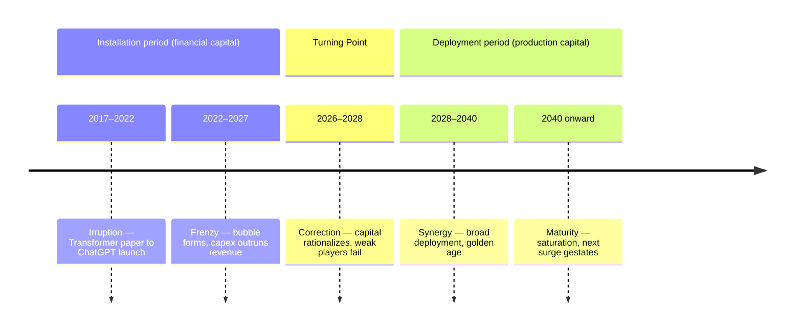
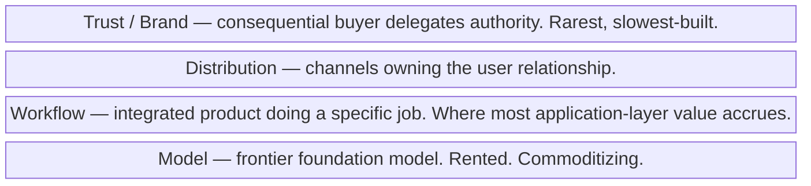
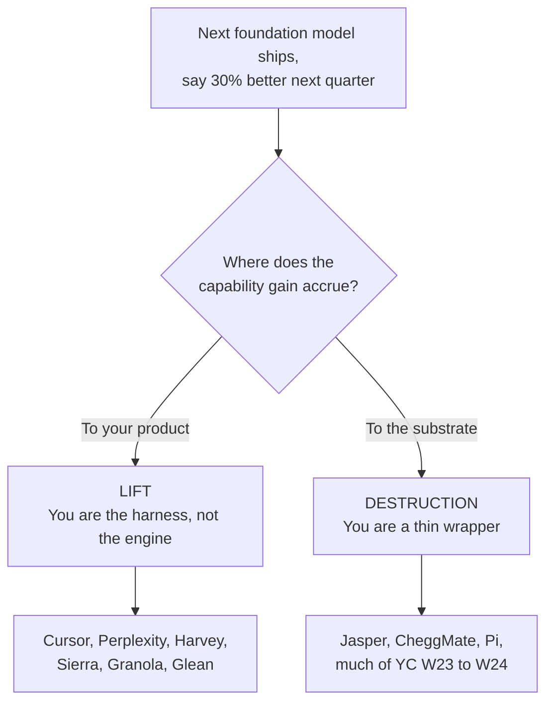
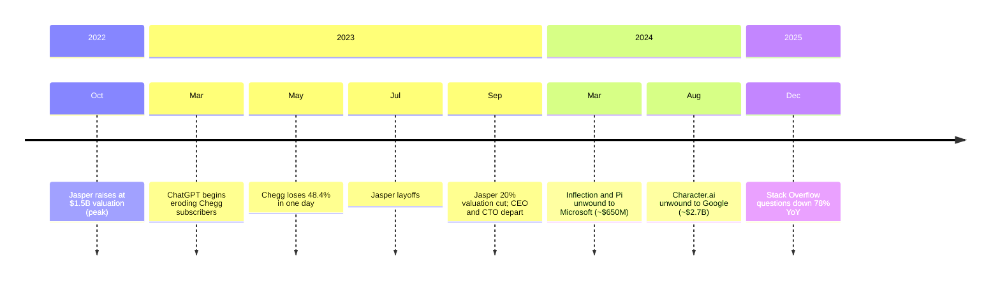

# Working Backwards from a Moving Target
## A Startup Philosophy for the Late 2020s

### I. The premise, and what is no longer in question

The older tradition has not been refuted. It has been put under stress.

Steve Jobs's 1997 line — delivered from a stool at WWDC, fielding a hostile question about OpenDoc and Java six months after his return to Apple — is the sentence the tradition is built on: *"You've got to start with the customer experience and work backwards to the technology. You can't start with the technology and try to figure out where you're going to try to sell it. And I've made this mistake probably more than anybody else in this room, and I've got the scar tissue to prove it."* Jeff Bezos turned the intuition into a managerial process at Amazon — the PR/FAQ, written before any code is written, working backwards from a customer who does not yet exist toward a product that does not yet exist either. In his 2008 shareholder letter Bezos contrasted "working backwards" with the "skills-forward" approach — *"We are really good at X. What else can we do with X?"* — which he conceded was "useful and rewarding" but warned would, if used alone, prevent a company from ever developing genuinely new capabilities. Clayton Christensen gave the same impulse a sharper analytic edge with Jobs-to-be-Done: a customer hires a product for a job, and the job, not the technology, is what has to be understood. Eric Ries gave the impulse a build-measure-learn loop. Uri Levine summarized the entire creed in five words: fall in love with the problem. Paul Graham wrote the shortest version: make something people want. Rob Fitzpatrick's *The Mom Test* taught founders how to talk to customers without lying to themselves. Marty Cagan formalized continuous discovery. The shared rule beneath stylistic differences is the same: problem before solution, customer before code, demand before supply.

That rule is not what is in question.

What is in question is what kinds of problem-first solutions are durable; which customer needs the customer is now incapable of articulating; and which moats remain standing after the next model release. Between November 2022 and May 2026, the marginal cost of producing working software collapsed for huge classes of work, foundation-model capabilities commoditized on a roughly quarterly cadence, and entire software-only categories were deleted inside a single product cycle. Stack Overflow's traffic has been in secular decline since ChatGPT's launch; per DEVCLASS (January 5, 2026), only 3,862 questions were posted on the platform in December 2025 — a 78% year-on-year drop — and as of May 2025 The Pragmatic Engineer was reporting that "the number of monthly questions is as low as when Stack Overflow launched in 2009." Chegg, valued at $14.5 billion in early 2021, lost 48.4% in a single day on May 2, 2023, after CEO Dan Rosensweig acknowledged on the earnings call that *"since March, we have seen a significant spike in student interest in ChatGPT"* — the first publicly listed company to formally book AI as the cause of revenue damage. The stock is down approximately 99% from peak. Jasper AI raised at a $1.5 billion valuation in October 2022, laid off staff in July 2023, cut its internal valuation 20%, lost both its CEO and CTO by September 2023, and is now a cautionary glossary entry. Inflection AI, which had raised $1.5 billion at a $4 billion valuation, was effectively unwound in March 2024 when Microsoft hired Mustafa Suleyman, Karén Simonyan, and most of the 70-person team — paying $620 million for a non-exclusive license to Inflection's models and an additional $30 million in legal indemnities, per Bloomberg. Character.ai followed in August 2024: Google paid roughly $2.7 billion in a similarly structured non-acquisition to bring Noam Shazeer and Daniel De Freitas back to DeepMind. Stability AI's economics broke under its own governance. Codecademy and the broader paid-tutorial market are eroding for the same reason Stack Overflow is.

On the other side of the ledger, the same conditions have produced unprecedented compounding. Anysphere, the maker of Cursor, crossed $100 million ARR in January 2025; $500 million by June; $1 billion by November; $2 billion by February 2026 — the fastest zero-to-$2-billion ARR run ever measured in enterprise software. Sierra, Bret Taylor and Clay Bavor's customer-service-agent company, hit $100 million ARR in twenty-one months and closed a $950 million round at a $15.8 billion valuation in May 2026. Harvey crossed $100 million ARR by August 2025 and reached an $11 billion valuation by March 2026. Perplexity went from a $121 million valuation in April 2023 to roughly $21 billion by early 2026, with annualized revenue near $200 million. Glean, per its December 8, 2025 press release, doubled ARR to $200 million in the nine months following its previous milestone — what CEO Arvind Jain described as placing Glean *"among the fastest-growing pure-play enterprise software companies of the decade."* Decagon went from a $1.5 billion round in June 2025 to $4.5 billion in January 2026. Granola, the locally-running AI notetaker, hit a $1.5 billion valuation in March 2026 after revenue grew 250% in a single quarter. Hebbia rebuilt the asset-manager research stack from $13 million ARR at its July 2024 Series B. None of this would have made sense to a 2021 investor.

A treatise for the late 2020s has to make sense of these two ledgers as one phenomenon, not two. The dead and the dominant share a substrate. What separates them is the philosophy.

### II. The one shift underneath the noise

It is tempting to narrate the last three and a half years as a sequence of capability releases: GPT-3.5, GPT-4, Claude 3, Llama 3, o1, Sonnet 3.5, DeepSeek-R1, the agentic generation. That sequence is the surface of the story, not its structure.

Underneath it is a structural relocation of where economic value is produced. Andrej Karpathy's frame — Software 1.0 (humans write explicit logic), Software 2.0 (the program is a trained set of weights that humans curate via data and architecture), Software 3.0 (the program is a paragraph of English, and the LLM is the interpreter) — is the cleanest mental model. Each layer subsumes the prior; none replaces it. A modern system writes 1.0 code, fine-tunes 2.0 weights, and orchestrates 3.0 prompts in the same execution. But the unit of product moves up. The unit of product is no longer "the application" — a discrete bundle of features deployed to a user — but "the workflow," with the model inside it as a substitutable utility. Karpathy described this transition with characteristic bluntness in a 2025 interview: he had built a small app called MenuGen that OCR'd a restaurant menu and rendered images of each dish; then he saw the same task done end-to-end inside a single Gemini call. "All of my MenuGen is spurious," he said. "It's working in the old paradigm. That app shouldn't exist."

Beneath Karpathy sits Richard Sutton's 2019 essay *The Bitter Lesson*. *"The biggest lesson that can be read from 70 years of AI research is that general methods that leverage computation are ultimately the most effective, and by a large margin. The ultimate reason for this is Moore's law, or rather its generalization of continued exponentially falling cost per unit of computation."* The bitterness Sutton identifies is the recurring discovery, across decades and subfields, that handcrafted human cleverness gets beaten in the long run by scaled compute applied to general methods — search and learning being the two that scale arbitrarily. His closing argument is not nostalgic: *"We should stop trying to find simple ways to think about the contents of minds… instead we should build in only the meta-methods that can find and capture this arbitrary complexity… We want AI agents that can discover like we can, not which contain what we have discovered."*

The bitter lesson is a research-program claim, but it has become an operating-strategy claim for founders. If the next foundation model is going to absorb your handcrafted feature, your handcrafted feature is not a moat — it is a debt. The scaling-law papers (Kaplan et al. 2020, Hoffmann et al. 2022 on Chinchilla) gave this an economic shape: model loss falls predictably with compute, parameters, and tokens, so capability is, to a first approximation, a function of capital and substrate availability. DeepSeek's R1 disclosure in January 2025 — and the more careful Nature paper of September 2025 that put R1's final training run at $294,000 across 512 H800s, atop a base model that itself cost roughly $5.6 million in compute — did not refute the scaling story so much as reveal that the cost curve was steeper on the way down than most operators had budgeted. The lab whose model you sit on top of can become 10× cheaper between your seed and your Series A.

Carlota Perez's *Technological Revolutions and Financial Capital* (2002) gives this a longer historical frame. Her sequence — Irruption, Frenzy, Turning Point, Synergy, Maturity — separates the *Installation* period of a technological revolution (driven by financial capital, ending in a bubble and a crash) from the *Deployment* period (driven by production capital, the "golden age"). In Perez's words from the Frenzy chapter: *"Financial capital reigns arrogant and production capital has no alternative but to adapt to the new rules; some agents with glee, others with horror."* The five great surges she identifies — the Industrial Revolution; Steam and Railways; Steel and Electricity; Oil, Cars and Mass Production; Information and Telecommunications — each took roughly half a century from irruption to maturity, with the bubble-and-crash typically falling in the second decade. By Perez's clock, AI is somewhere mid-Frenzy. David Cahn's "AI's $200B Question" (September 2023), updated to "$600B" by June 2024, is the Perez framework expressed as a Sequoia memo: the gap between AI infrastructure capex and end-user revenue is too large to be sustained without either a major deflation in compute or a major inflation in monetizable value, probably both.

*Where AI sits in Carlota Perez's surge pattern in mid-2026.*

The Bitter Lesson and Perez are not in tension. They are the same story told at two timescales. Sutton tells you what wins technically (general methods scaled with compute). Perez tells you what happens economically when general methods scaled with compute attract financial capital faster than production capital can absorb them. Both imply, for the founder, the same operating posture: you are building on a substrate that is simultaneously deflating in unit cost and inflating in capability, inside an investor regime that has not yet rationalized either. Your job is to identify what *that substrate cannot do for the customer on its own* and to build a product whose value comes from the part the substrate cannot do.

This is the one shift. It is not "AI changes everything." It is: the layer at which value is captured has moved up, and it keeps moving.

### III. What of the older tradition loads — and why it loads harder

Take the canonical pieces of the old creed one at a time, and notice which now matter more, not less.

**Jobs-to-be-Done.** When the cost of producing a generic solution approaches zero, the only thing that distinguishes one solution from another is whether it actually fits the job. The hard part used to be building the thing; the hard part is now picking the right thing to build. Christensen's framework was always under-utilized; it now becomes the most efficient way to allocate finite founder attention. The wrappers that died — Jasper for marketing, Pi for companionship, much of the YC-batch GPT-3 cohort — did not die because they were thin. They died because the "job" they were hired to do (write me marketing copy, talk to me kindly) was a job a general-purpose chat interface could do at zero marginal cost. They had built solutions to problems that the substrate itself was about to solve for free.

**Painkiller vs. vitamin.** With a near-infinite supply of cheap-feeling AI capability, vitamins are now nearly worthless. ChatGPT itself is the world's most accessible vitamin: a free, friendly, infinitely tolerant generalist. Anything you build that competes on "nice to have" loses to the chat box, because the chat box is also nice to have and the customer already has it. Painkillers — products people will pay for because the pain of not having them is acute, recurring, and specific — are now nearly the entire defensible market. Harvey is a painkiller for law firms whose alternative is paying associates $400 an hour to read documents. Sierra is a painkiller for customer-service organizations whose alternative is a roughly $400-billion-a-year human contact-center industry (Bret Taylor's stated estimate of the addressable market). Cursor is a painkiller for developers whose alternative is typing. The vitamin/painkiller distinction is older than this era; it now does more work per syllable than it ever has.

**Founder-market fit.** This is the heuristic that hardens most in the new regime, and the most under-appreciated implication of foundation models is what they do to its value. AI commoditizes execution. AI does not commoditize taste, domain insight, or earned trust. If anything, by making it possible for any team to ship competent software in any vertical, foundation models raise the relative return on the things models cannot supply: an intuition for what regulated buyers will actually deploy; the relationships that get a pilot inside an AmLaw 100 firm; the years of misery at the call center that tell you which 7% of tickets cannot be safely automated. Harvey's co-founder Winston Weinberg is a former O'Melveny securities and antitrust litigator. Sierra's founders include Bret Taylor (former co-CEO of Salesforce) and Clay Bavor (former head of Google Labs). Hebbia was built by people who already knew where the dollars hide in a long PDF — its product is used by roughly a third of the world's largest asset managers. Decagon's founders saw enough customer-support flows to know which collapse to a deterministic workflow and which require judgment. The wrappers that died were generally built by people who could see the capability but did not have a customer in their bones. Founder-market fit was a useful tiebreaker in 2017; it is now a survival trait.

**The Mom Test.** Fitzpatrick's discipline — asking specific questions about specific past behaviors, never asking customers to evaluate your idea in the abstract — matters more when the speed of capability change makes hypothetical questions almost meaningless. Every "would you use an AI that did X" question now answers itself; the customer would *of course* use one. The only useful question is "show me the last three times you did X, what happened, how much time it took, what went wrong, what you would have paid to make it stop." The Mom Test was always a tool for cutting through enthusiasm; in 2026 it is a tool for cutting through hallucinated enthusiasm.

**Simplicity as discipline.** When every team can ship features at four times the historical velocity, the constraint shifts from "what can we build" to "what should we not build." The cost of complexity has not fallen; the cost of avoiding complexity is now most of what differentiates a product. The 37signals position — that excellent software is restrained software, and that "AI features" are a temptation toward bloat — is the one-take counterpoint to AI maximalism. Whether or not you accept the politics, the design observation is correct: the products people actually love in this era are the ones that did less, not more, with the new substrate. Cursor's UX is not a Christmas tree of LLM features. Granola is a notebook that takes notes.

**Customer obsession.** Trivially still true. But now with a sharper meaning: when the substrate provides general competence cheaply, the only differentiating advantage left is specific knowledge of *this* customer's specific situation, which only customer obsession produces. Hebbia knew that a credit analyst at a $50B fund does not want a chat interface — they want spreadsheet cells with sources. Decagon knew that a customer-service VP at an airline cannot adopt an agent that cannot demonstrate a measurable resolution rate per ticket type. These are not insights you get from a model. You get them from the customer.

Problem before solution; painkiller over vitamin; founder-market fit; the Mom Test; restraint; customer obsession. Every one of these loads harder. The tradition survives the shift.

### IV. What bends, and what breaks

Two pieces of the older tradition bend under the new conditions, and one piece breaks. They have to be named precisely.

**What bends: "the customer doesn't know what they want until you show them."** Jobs's other famous line — that focus groups would never have produced the iPhone — is the recurring caveat the tradition has always carried. The Ford apocrypha about the faster horse expresses the same intuition. In the old regime this was a sometimes-true exception: most of the time you should listen to customers, but occasionally a capability arrives that the customer cannot imagine, and you have to push it onto them.

In the new regime this has gone from caveat to structural condition. Foundation-model capabilities now arrive faster than users can articulate problems for them. The canonical example is ChatGPT itself: an OpenAI research preview, half-thrown over the wall, whose actual product-market fit was discovered by users in the days after launch. Cursor's founders did not start with a survey of developers asking what they wanted; they re-skinned an IDE around a capability that did not exist eighteen months earlier, and let the developers tell them, by using it, that this was what they had wanted. Perplexity did the same thing with search. Granola did it with meeting notes. The product was a guess that the capability was about to be useful at a particular price point for a particular ritual, and the customers confirmed the guess by adopting it.

Capability-push is not, in this era, a sin against the customer-experience tradition. It is sometimes the only way to find the actual customer experience. The line is not "do you start with the customer or the technology" — it is "are you pushing a capability into a *specific job a customer was already trying to do badly*, or are you pushing a capability in search of a job." Cursor was a capability pushed into the job of "I am typing the same import statement for the thousandth time." Pi was a capability pushed into the job of "I want a friend," which was both not a job a paying customer would budget for and a job the substrate itself would soon do for free. The seam is between capability-push toward a job and capability-push toward a vibe.

**What also bends: Lean Startup's MVP discipline.** The minimum-viable-product was conceived in an era where building was expensive and learning was cheap. Now building is cheap and learning — distinguishing real demand from agreeable curiosity — is what's expensive. Ries's loop still works, but the actual scarce resource has flipped. A 2026 founder can ship an MVP in a weekend; the bottleneck has moved to distribution, to convincing a real buyer to use it, and to writing the evals that tell you whether your product is actually getting better or merely getting different. The MVP is no longer the learning device; the *eval suite* is. We will return to this.

**What breaks: the moat made of documentation, the moat made of accumulated answers, and the moat made of knowing things the customer doesn't.** Stack Overflow, Chegg, Codecademy, Quora-as-knowledge-base, the broader paid-tutorial economy, much of the SEO-traffic-driven content business — these were all monetized informational moats. Foundation models, having ingested the moats, dissolve them. Chegg, with its 79-million-problem answer library, was the largest such moat in formal education; it lost 99% of its market value in 39 months. What the Chegg case teaches is not the cliché ("ChatGPT killed Chegg"). It is the specific claim that any business whose primary asset is an indexed body of static answers to common questions is a business whose asset is now public infrastructure. The next layer up — judgment, current-event integration, accountable advice, regulated outcome — survives. The layer Chegg occupied does not.

This breakage is more general than knowledge bases. It applies to any business whose value proposition was *we know things the customer doesn't and we will tell them, transactionally, for money*. Documentation businesses, paid-tutorial businesses, basic legal-advice subscriptions, the cheap end of analyst research, undifferentiated translation services, undifferentiated copyediting, much of tier-1 customer support — all are eroding for the same reason. What survives in each category is whatever the model cannot do alone: workflow integration, accountability under regulation, the consequential decision, the relationship.

### V. The new defensibility map

Hamilton Helmer's *7 Powers* — scale economies, network economies, counter-positioning, switching costs, branding, cornered resource, process power — was the cleanest synthesis of strategic moats produced in the last decade. It survives the AI shift, but with re-weighted entries.

**Scale economies** at the model layer are now extreme — only a small number of organizations can train frontier models, and that number is consolidating around capital-rich, compute-rich incumbents (OpenAI/Microsoft, Anthropic/Amazon/Google, Google itself, Meta, xAI, and a few Chinese labs). At the application layer, however, scale economies are weaker than they were in SaaS, because the marginal cost of producing a competitive application has fallen and customers can re-platform faster. Cursor is a $50B company; if a competitor shipped a meaningfully better IDE next quarter, half its individual users could switch in a weekend. Scale economies do not vanish — Cursor's training data from over a million paying developers is a real asset — but they no longer underwrite an entire moat.

**Network economies** survive in their classic forms (marketplaces, communications) but acquire two new variants: the *data flywheel* (where usage produces proprietary fine-tuning data) and the *trust flywheel* (where consequential successful deployments become testimonials that close the next deployment). Sierra exhibits both; Harvey exhibits both; Cursor's data flywheel from over a million developers writing real code, accepting and rejecting completions, is one of the genuine durable advantages in the developer-tools category.

**Counter-positioning.** This is the Helmer power that increases the most in the AI era. Incumbents have business models that AI agents would directly cannibalize — a call-center BPO cannot rationally replace its own workforce with Sierra; a paid-tutorial business cannot rationally replace its own subscribers with ChatGPT; a CRM vendor charging per seat cannot rationally promote per-outcome pricing. Counter-positioning has always been the most underestimated of the seven powers because it requires incumbents to choose between two bad options, both visible at the time of the choice. In 2026 it is the single most reliable predictor of which startups will not get crushed: do they have a pricing model the incumbent cannot adopt without destroying its own P&L? Sierra's outcomes-based pricing — pay only for resolved tickets — is the textbook example.

**Switching costs** continue to operate, but the unit of switching has changed. Customers no longer switch *applications* primarily; they switch *workflows* and *data substrates*. The application is now the thinnest of the layers. The switching cost lives in the integrated context — the documents Glean has indexed, the customer histories Sierra has trained on, the codebase Cursor has embedded.

**Branding.** Almost entirely dependent on trust now. In a market where models hallucinate, AI brand equity is essentially "we are the AI you can trust to do X without embarrassing you." Perplexity has explicitly bet on this with its citation-first design and its February 18, 2026 decision, confirmed to the Financial Times, to permanently exit advertising. One Perplexity executive told the FT: *"A user needs to believe this is the best possible answer, to keep using the product and be willing to pay for it. The challenge with ads is that a user would just start doubting everything."* Anthropic's brand is constructed almost entirely from a posture of responsible deployment. Conversely, the brands that died — Pi, much of Character.ai — never built trust *for a specific consequential use*; they built attachment to a personality, which is a much weaker asset than people thought.

**Cornered resource.** Compute is the new oil. Energy is the new compute. Top researcher talent is its own cornered resource — Google paying roughly $2.7 billion in effect for Noam Shazeer, and Microsoft paying $650 million for Mustafa Suleyman's team, is what cornered-resource pricing looks like in this market. For application-layer startups, the cornered resource is usually a proprietary data asset (a long-standing relationship with regulated buyers; a labeled domain dataset competitors cannot replicate; a partnership that gives privileged distribution).

**Process power.** Helmer's process power — embedded organizational practices competitors cannot copy even when they see them — is harder to claim in an era when shipping cadence has compressed. But there is one important version of it that is becoming a durable moat: *eval-driven development discipline*. A company that has invested years in measuring whether its product is actually doing the customer's job — building proprietary benchmarks for its domain, capturing failure modes, refining the prompt-and-orchestration stack against those benchmarks — has accumulated something competitors cannot replicate by spinning up another agent. Sierra's "Agent OS" and Cursor's internal eval suites are process power in this sense.

Two newer frames belong next to Helmer. Simon Wardley's mapping framework lets you locate each piece of your stack on the evolution curve from genesis to commodity. The lesson of 2022–2026 in Wardley terms is brutal: foundation models have moved from custom-built (2018) to product (2020) to commodity (2024) faster than any prior technology layer in computing history. Anything you operate that depends on the model layer remaining differentiated is operating on a layer that has already commoditized. Your moat has to live above it. Ben Thompson's Aggregation Theory, updated for AI, gives the corollary: aggregators on the demand side (ChatGPT, Gemini, Perplexity, Cursor for developers) accrue value by owning the user relationship and then commoditizing the suppliers. Aaron Levie's complementary thesis is that incumbents who already own the system of record — Salesforce for CRM, Workday for HR, Box for unstructured documents — are the natural beneficiaries because agents have to operate on something, and that something is the system of record. *"The value of that system of record those agents are operating in, we think will be even more important, whether it's your unstructured data or a CRM system like Salesforce, or an HR system like Workday,"* Levie told Jon Fortt in 2025. *"And I think that's the part that maybe some of the investor market doesn't quite perceive."* But Levie has also been careful to leave room for greenfield startup plays — speaking with Foundation Capital, he advised: *"I would build AI products where there is no incumbent. Go after categories where there was no good software because it wasn't a real software market before. It was things people did manually. Now agents can do them for the first time and you can sell them to the people doing them manually."*

The most useful synthesis is to imagine the value stack as four layers:
- **Model layer:** training the foundation model. Capital-intensive, increasingly concentrated. Almost no founder should operate here.
- **Workflow layer:** the integrated product that performs a specific job in a specific industry. Where most durable application-layer value will accrue.
- **Distribution layer:** the channels that put the product in front of the customer. Owned mostly by incumbents and a small number of native aggregators.
- **Trust/brand layer:** the willingness of a consequential buyer to delegate authority to your product. The rarest and slowest-built layer, and increasingly the binding constraint on enterprise revenue.

*Where durable advantage lives in the late-2020s value stack.*

Durable advantage in the late 2020s lives mostly at the intersection of workflow and trust, with a leg into distribution. The model layer is rented. That is the new map.

### VI. The strategic option set, examined honestly

Five paths are open to a founder in mid-2026. Each has conditions under which it works and conditions under which it is a trap.

**Path one: build on top of frontier models.** This is the Cursor / Perplexity / Granola / Harvey / Sierra / Decagon / Glean path. It works when (a) you are pushing the capability into a specific job a specific customer is already trying to do, (b) your wedge is workflow integration, taste, or distribution, not the underlying capability, (c) you have a credible answer to the question "what is our position once the underlying capability is free," and (d) your shipping cadence is fast enough that the model labs cannot catch up at the application layer without significant organizational dis-economies. It is a trap when your value proposition is essentially "the model, but with a nicer UI" — Jasper's gravestone. It is also a trap when your customer is the same customer the model provider can address directly (consumer chatbot competing with ChatGPT; coding assistant competing with the same lab's own Claude Code).

**Path two: train your own model.** Almost never the right call. BloombergGPT, launched March 2023 with much fanfare, is now an instructive footnote — the general-purpose frontier models surpassed its domain capabilities within a year. Harvey debated whether to train its own model and chose, correctly, not to; it now blends frontier models from multiple providers. The DeepSeek cost disclosure of January–September 2025 ($294,000 for the R1 final training run, atop a ~$5.6 million base model and an estimated ~$1.6 billion in total infrastructure, per SemiAnalysis) suggests that the cost of catching the frontier may be falling faster than the cost of merely keeping up — but the disclosure also revealed that even the famous low number came on top of a multi-hundred-million-dollar capital base. The exceptions to "do not train your own model" are: (1) you are a frontier lab, in which case this is not a strategy question; (2) you have a uniquely proprietary corpus on which a domain model demonstrably outperforms a fine-tuned frontier model (rare; even more rare once frontier models support long context and retrieval); (3) you are operating under regulatory constraints (data residency, sovereign compute) that prohibit reliance on US frontier providers. Almost everyone else should rent.

**Path three: own a vertical workflow in a regulated or domain-deep industry.** This is now the highest-quality strategy available to most founders, and the data bears it out. Harvey ($11B in legal). Sierra ($15.8B in customer service). Decagon ($4.5B in support). Hebbia (financial-services research, used by roughly a third of the world's largest asset managers managing $15T+ AUM). Glean ($7.2B in enterprise knowledge work, $200M ARR). Abridge, Ambience, and the broader healthcare-documentation cohort (multi-billion). It works when the vertical has (a) acute pain, (b) regulated buyers willing to pay for accountable outcomes, (c) workflow complexity that resists a one-prompt solution, and (d) data and trust requirements that exclude generalist providers. It is a trap when the "vertical" is actually a horizontal use-case in costume — a writing assistant for marketers, a generic legal Q&A — because the moat is shallower than it looks and the substrate will catch up.

**Path four: own distribution.** This is the incumbent's path, and it is open to a small number of new entrants that have already accumulated distribution (Perplexity arguably, Cursor inside developer mindshare). Aaron Levie, Microsoft, and a16z have been arguing some version of this since 2023: in a world where the model is cheap and the application is easy, the binding constraint is getting in front of the user, which incumbents already own. Microsoft inserted Copilot into Office and won the corporate AI footrace for a year by default. Google inserted Gemini into Search and reversed the early Perplexity narrative. The trap here is that distribution-led plays often produce features, not products — Bing Chat is the canonical example. Distribution is a necessary condition, not a sufficient one.

**Path five: combine.** In practice the durable companies are doing two or three of the above. Cursor: build on top, accumulate distribution (over a million paying developers and 70% of the Fortune 1000), accumulate proprietary data, train specialized auxiliary models (Composer). Harvey: build on top, vertical workflow, trust, embedded legal-engineering teams inside customer firms. Sierra: build on top, vertical workflow, distribution via Bret Taylor's network, brand. The strategic option set, examined honestly, is not five mutually exclusive bets; it is a menu of complementary positions, and the durable companies hold three or four of them.

### VII. The capability ratchet, and the tests serious founders are using

The single most useful concept the era has produced is the *capability ratchet*: the next model release moves underneath your product, sometimes lifting it, sometimes destroying it. The Jasper case is the canonical destruction (the next OpenAI release made its core value proposition free); Cursor is the canonical lift (every model upgrade makes Cursor better, because Cursor is the harness, not the engine). The difference is structural, not lucky. Cursor is positioned so that capability gains accrue to its product; Jasper was positioned so that capability gains accrued to its substrate.

*Before shipping any feature, ask whether the next model release lifts your product or eats it.*

Out of this distinction the serious founders have converged on a small set of explicit tests. They are worth quoting in shorthand because in 2026 they get used as actual decision tools.

- **The GPT-N+1 test.** If OpenAI / Anthropic / Google ships a model 30% better next quarter, does your product get *better* or get *replaced*? Better: you are a harness. Replaced: you are a thin wrapper.
- **The autonomous-agent test, in two parts.** *What value does your product deliver that a fully autonomous agent could not reproduce on its own?* (Distribution, workflow integration, trust, regulated accountability, proprietary data.) And the inverse: *what value does your product deliver that only an agent can deliver* — that was impossible before agents existed? Categories that pass both halves of the test are where the new durable companies are being built.
- **The compounding test.** Does usage make you better? Three flywheels qualify: data (you accumulate proprietary fine-tuning signal), taste (your team's product judgment compounds because you are closest to the customer), distribution (your installed base lowers the cost of selling the next product).
- **The trust test.** Would a buyer with consequential authority — a general counsel, a CIO, a head of customer experience — delegate a real decision to your product? This is binary, and it determines whether you have a $10M revenue ceiling or a $1B one.
- **The shipping-cadence test.** Your moat is partially the speed at which you can absorb new capabilities. Cursor's stated moat is its release cadence; founders in this era talk about it as openly as they used to talk about their NPS.
- **The Wardley placement test.** On Wardley's evolution curve, every component of your stack is moving rightward (toward commodity). The question is whether you are operating at a layer that is moving rightward slower than your customer's willingness to pay. Foundation models have already commoditized. Workflows have not. Trust has barely begun to.

Behind these tests is a meta-discipline: **capability budgeting.** Design assuming the underlying model will be *N* times better every *M* months — most operators are using ~2× capability every ~6–12 months as the planning assumption, recognizing that the curve is jagged. Anything in your roadmap that depends on the model staying *as bad as it is today* is a feature you should not build; anything that gets better as the model gets better is a feature you should over-invest in. Most thoughtful product teams now build a sliding-scale roadmap: a feature set for the current capability level, a feature set unlocked at the next, and an architecture flexible enough to absorb the difference.

The replacement for spec-driven development is **eval-driven development**: you do not specify what the model should do, because you cannot. You specify what success looks like, build an evaluation harness that measures it, and treat the evals as the binding artifact of the product. Karpathy's "vibe coding" tweet of February 2, 2025 — *"There's a new kind of coding I call 'vibe coding', where you fully give in to the vibes, embrace exponentials, and forget that the code even exists"* — is the consumer-facing version of this discipline. The professional version, increasingly, is: you write the evals, the model writes the code, and the evals are what you sweat over.

### VIII. The graveyard

Each of the dead has a specific lesson. The gloss "wrappers are bad" is too cheap.

*Selected casualties of the capability ratchet, by quarter.*

**Jasper AI.** Founded January 2021 as a GPT-3-powered marketing-copy assistant. $1.5B valuation October 2022, layoffs July 2023, internal valuation cut 20% by September 2023, founders displaced, slow grind down. *Lesson:* if your wedge is a UI on top of a capability the underlying lab will give away for free in the next general release, the lab will give it away in the next general release. Marketing copy was a vitamin, not a painkiller; ChatGPT solved the vitamin job at zero marginal cost.

**Inflection / Pi.** A $4B valuation, $1.5B raised, world-class founding team, dissolved by the Microsoft non-acquisition of March 2024 for ~$650M of license fees and indemnities, with most of the team moving to Microsoft. *Lesson:* consumer AI without a specific job and without pricing power is structurally indefensible. Empathic chat is real, valuable, and not a business — the customer relationship is too shallow and the substitute too cheap.

**Character.ai.** Roughly $1B valuation, large engaged user base; Google paid approximately $2.7B in August 2024 in a non-acquisition that returned Noam Shazeer and Daniel De Freitas to DeepMind. *Lesson:* engagement is not revenue. A product that millions of people use but do not depend on for a consequential outcome cannot price meaningfully; the founders, recognizing this, took the talent exit — which is what cornered-resource pricing for AI researchers looks like on the supply side.

**Stability AI.** Open-weights image-generation pioneer, founder departures, governance and financial collapse 2024. *Lesson:* open-weights leadership without a sustainable business model is a charitable contribution to the field. Releasing weights is not, by itself, a strategy.

**Stack Overflow.** Not a startup, but the category death of community-curated documentation is the structural lesson. New questions on the platform dropped 78% year-over-year in December 2025 (3,862 questions for the month). *Lesson:* any business whose moat is an indexed body of static answers becomes public infrastructure the moment those answers are ingested into a frontier model. The same logic ate Chegg.

**Chegg.** The clearest single data point of the era. $14.5B peak market cap (2021), down 48.4% in a single day on May 2, 2023, after Dan Rosensweig acknowledged that "since March, we have seen a significant spike in student interest in ChatGPT." Stock down approximately 99% from peak. CheggMate, the GPT-4 partnership launched in panic, did not retain subscribers. *Lesson:* building your own AI feature on top of OpenAI does not differentiate you from OpenAI. If your customer is choosing between your AI feature and ChatGPT itself, they will increasingly choose ChatGPT.

**Codecademy and the broader paid-tutorial market.** Acquired by Skillsoft in 2021, the business model — pay for structured progression through coding lessons — is eroding for the same reason Stack Overflow's is. The instructional, scaffolded explanation of a concept is now available to anyone, infinitely, free, in any style. What survives in education is what cannot be replicated by a tutor with infinite patience: credentialing, peer-cohort effects, accountability, real-world application. The lesson generalizes well beyond education.

**The YC-batch wrapper cohort.** A pattern repeated across batches from W23 through W24: a thin product layered on the OpenAI API, dies within one or two OpenAI keynotes. Y Combinator managing partner Jared Friedman, speaking to TechCrunch on March 6, 2025 about the W25 batch, said in a video on the firm's channel: *"Every one of these people is highly technical, completely capable of building their own products from scratch. A year ago, they would have built their product from scratch — but now 95% of it is built by an AI."* That statistic is the leading indicator of the next graveyard population: products built so quickly that no one stopped to ask whether the substrate would soon obsolete them.

### IX. The new operating practice

Out of these tests, lessons, and tools a coherent set of operating practices is now visible.

**Eval-driven development.** Already mentioned, but worth restating because it is the largest single change in product-team mechanics. The spec is now the eval set. The product manager's job is, increasingly, to define what success looks like rigorously enough that an automated harness can measure it. The designer's job is increasingly to author evals as well as interfaces — to specify what the model should produce in a given context concretely enough that the team can tell when it has stopped doing it. The unit of progress is no longer "we shipped a feature"; it is "the eval scores improved on this dimension." This sounds like ML-engineering culture spreading into product, and it is.

**The PM-as-builder.** With AI coding assistants, the cost of going from a spec to a working prototype has fallen to near zero. PMs at AI-native companies now build their own working mockups, sometimes their own working products. This collapses the spec→design→engineering loop and removes a layer of organizational overhead. The PMs who thrive are the ones who can build; the PMs who do not adapt are increasingly redundant.

**The shrinking engineering team.** Cursor reportedly hit $300M ARR with under 100 employees and crossed $1B with about 300; its February 2026 $2B ARR figure was achieved with around 150–200 people. Perplexity, at approximately $200M ARR, operates with roughly 90–100 employees per multiple secondary sources, with engineering accounting for around 60% of headcount. Hebbia was famously small. The implication for hiring, equity grants, and runway planning is significant: small teams can now address markets that previously required teams ten times their size. The corollary — that small teams are also easier to displace if their wedge collapses — is the structural tension.

**Capability budgeting as a planning discipline.** Already covered: treat the underlying model as a forecast variable, not a constant. A 2026 product roadmap should explicitly identify which features assume current capability, which assume next-generation capability, and which assume capability beyond what the labs have publicly demonstrated.

**Outcome-based pricing.** Sierra's outcomes-pricing model — pay per resolved ticket, not per seat — is rapidly becoming the default for agentic products because (a) it aligns the vendor and buyer on what success actually means, (b) it counter-positions against incumbents whose per-seat pricing collapses when the seats stop being human, and (c) it forces vendor discipline on evals (you cannot bill for outcomes you cannot measure). Expect the next two years to see most agent companies follow Sierra's model.

**Shipping cadence as a stated moat.** Mentioned aloud at board meetings now. Anysphere's leadership talks about it openly; so does Perplexity's. Most thoughtful operators target a release cadence at least as fast as the underlying labs they sit on top of, on the theory that the only way to absorb capability releases without losing your wedge is to absorb them faster than competitors.

**The one-person and ten-person unicorn thesis.** Pieter Levels has demonstrated multiple solo $5M+ ARR businesses. Sahil Lavingia has argued for the ten-person company structure. Sam Altman, in an interview with Reddit co-founder Alexis Ohanian first widely reported by Fortune on February 4, 2024, said: *"In my little group chat with my tech CEO friends, there's this betting pool for the first year that there is a one-person billion-dollar company. Which would have been unimaginable without AI and now will happen."* The honest read: solo $5M–$50M ARR businesses are now genuinely possible and increasingly common; one-person *billion-dollar* businesses are mostly a meme, because at sufficient scale every business needs a sales motion, a support function, a security and compliance posture, and a legal function — none of which are well-served by an AI agent in 2026. The real shift is not from 100 employees to 1, but from 100 employees to 10–20.

### X. Org, labor, and capital consequences founders must design for

The labor effects are no longer speculative. Brynjolfsson, Li, and Raymond's customer-service paper — the canonical *Generative AI at Work* study — found a 14% average productivity gain across 5,179 customer-support agents using a generative AI assistant, with a 34% gain for novice and low-skilled workers and minimal impact on the most experienced. The Anthropic Economic Index reports (February 2025, September 2025, January and March 2026) confirm and extend the pattern: usage concentrated in software development and technical writing; roughly 36% of occupations show AI use in at least a quarter of their associated tasks; directive task delegation rose from 27% to 39% in eight months; experienced users automate more successfully than newcomers. AI is selectively absorbing the higher-skill portions of jobs — Claude covers tasks requiring an average of 14.4 years of equivalent education while the economy's average task requires 13.2 — meaning the simpler portions of work are what remains for humans, a finding with uncomfortable implications for the wage distribution.

For founders, this implies a specific set of design choices. Hire fewer people, more carefully. Grant equity in ways that survive multi-year capability drift (cliffs and accelerators that assume the role itself may be redesigned). Invest in eval infrastructure as a first-class engineering discipline. Plan for tier-1 support, basic QA, and basic content roles to shrink or disappear; plan for taste-bearing roles (design, customer-success leadership, product judgment) to compound in value. The end of certain BPO categories is real — Brynjolfsson's 14%/34% gain is what a contact-center P&L looks like one year into deployment; Sierra is what it looks like three years in. Accenture and the major BPOs are already restructuring around this. So are equivalent in-house functions at large enterprises, and the layoff waves of 2024–2026 (Microsoft, Meta, Google, Salesforce, Workday, Klarna, Duolingo, IBM, Chegg) have all been narrated in some part as "AI-native repositioning" — partly real, partly theater for shareholders. The signal is the structural reduction in headcount per dollar of revenue; the theater is the press release that explains why.

On the capital side, the Cahn $600B-question gap has not closed; if anything the 2024–2026 infrastructure buildout (Stargate; the Microsoft and Google capex cycles; the sovereign-compute moves in the Gulf, the UAE, Saudi Arabia, France, the UK) has widened it. For founders, this matters because the cost of capital for AI startups remains historically cheap *for now*, with the corresponding implication that valuation regimes can correct sharply. Plan runway, hiring, and burn assuming the current capital environment is the Frenzy, not the new normal.

### XI. The critiques, the counter-trends, and the bubble case taken seriously

The bubble case is real and the treatise that ignores it is dishonest. Cahn's analysis remains the cleanest articulation of the math: AI capex implies AI revenues that do not yet exist, by something on the order of half a trillion dollars per year. Daron Acemoglu's "The Simple Macroeconomics of AI" puts the upper bound on AI's ten-year total-factor-productivity contribution at *"no more than a 0.71% increase in total factor productivity over 10 years"* — not nothing, but an order of magnitude below the Goldman Sachs forecast of 7% global GDP growth and 1.5% per annum productivity gain over a decade, and below McKinsey's comparable figures. Acemoglu's number could be wrong (Brynjolfsson, the more optimistic of the leading economists, has argued at the firm level for considerably larger gains, and the customer-support paper suggests larger effects in specific occupations). But the gap between Acemoglu's bound and the AI capex commitments is the gap that matters.

If Acemoglu is closer to right than Goldman is, the implication for founders is not "AI is fake." The implication is that *the value will accrue narrowly* — to a small number of products that genuinely complete a customer's job in a measurable, paid way — and that the broad productivity boom assumed by the capex cycle will not materialize on schedule. Which means the bubble survives only as long as the financing does. Plan accordingly.

The counter-trends are also real. The 37signals / Basecamp / DHH position — that AI features are bloat, that small focused human teams beat AI-augmented ones in many software categories, that craft software has a permanent home — is the most articulate counter-positioning case. It will not be the dominant strategy, but it will sustain meaningful niches: privacy-focused tools, premium consumer software, products that explicitly counter-position on human authorship (newsletter writers, podcasters, certain consultancies, the entire "made by a human" labeling trend that has begun to appear in certain product categories). Privacy and data residency are becoming explicit moats in regulated geographies — EU buyers increasingly demand non-US-hosted inference; the Gulf states have been building sovereign compute precisely for this. Regulatory shifts (the EU AI Act, US sectoral regulators on healthcare and finance, the FDA's posture toward AI-mediated medical decisions) are creating compliance moats that favor incumbents with regulatory experience and disadvantage capability-pure startups.

The open-weights story — DeepSeek's R1, Meta's Llama, Mistral, Qwen, the Chinese open-weights cohort more broadly — is the strongest deflationary force on proprietary-model strategies. The simplest expression of its implication: any moat that depends on "we have access to the best model and our competitor does not" has a half-life measured in months. The bitter lesson cuts both ways: general methods scaled with compute have produced the frontier; general methods scaled with compute will produce, eventually, an open-weights version of the frontier that is good enough for most application-layer uses.

### XII. The psychology of building under capability uncertainty

Founders default to one of two failure modes, and both are worth naming because they are everywhere.

The first is **reflexive AI maximalism**: every product question gets the answer "make it an agent," every roadmap gains an agentic layer that is not actually the painkiller the customer is asking for, every meeting begins with the phrase "in an AI-first world." This is the failure mode of founders who are pattern-matching to the era rather than to their customer. The Jasper failure mode at scale.

The second is **reflexive AI denial**: the assumption that nothing fundamental has changed, that the older playbook holds without amendment, that the customer-discovery process can ignore the substrate. This is the failure mode of incumbents and of founders trained in the pre-2022 SaaS era who are protecting their identities against an uncomfortable update. The Chegg failure mode at scale.

Both fail. The Stockdale paradox is the right posture: *faith that the era will produce great companies, paired with brutal honesty about the brutal facts of your own current situation.* The brutal facts are: your differentiator may evaporate in a quarter; your underlying model is rented; your competitors include both the lab you sit on top of and the incumbent whose distribution you do not have. The faith is: in every prior technology revolution the durable companies have been built precisely in the years of maximum disorientation, and the founders who hold problem-curiosity through the disorientation are the ones who build them.

The ego trap deserves a specific call-out. The most common failure of competent founders in 2026 is attachment to a wrapper they built before the capability moved underneath. The product was clever; the customers liked it; the metric of personal pride is the cleverness; the move that the substrate is about to absorb the cleverness is invisible until the customer churn arrives. The discipline is to keep the customer at the center of identification, not the product. *"Fall in love with the problem, not the solution"* (Uri Levine) is the older creed's most durable contribution to the new era because the new era's most reliable failure is mistaking the solution for the company.

### XIII. Macro projections for 2027–2030

Some falsifiable predictions, offered in the spirit that bad predictions are more useful than no predictions.

**Compute geopolitics.** The US, China, the EU, and the Gulf states (UAE, Saudi Arabia, Qatar) will each have sovereign frontier-model capabilities by end of 2027. India and Japan will partially have them, mostly through partnerships. The export-control regime will have tightened twice more by 2028. The geopolitical contest will increasingly be framed in terms of sovereign compute capacity, and the political economy will reward governments that subsidize energy and grid expansion to attract compute.

**Energy and grid.** The binding constraint on US AI buildout is no longer chips, it is electrons. By 2028 the marginal AI workload will be sited where power is — Texas, the upper Midwest, Iceland, parts of the Gulf — not where the customers are. Several Fortune 500 enterprises will own dedicated power assets by 2029. The political contest over data-center power consumption will intensify in 2026–2027 and constrain expansion in jurisdictions that do not act early.

**Agentic commerce.** Agents transacting with other agents — your shopping agent negotiating with a vendor's pricing agent, your scheduling agent with a service provider's intake agent — will be common by 2028 in specific verticals (travel, logistics, B2B procurement, basic legal contracting). The protocols and trust layer for this are being built now (Anthropic's MCP and various competing standards). When the buyer is software, the marketing function changes structurally; brand becomes a credential the buyer-agent verifies, not a feeling the buyer-human has. A specific knock-on prediction: the SEO industry as it exists in 2025 will be approximately 30–50% smaller by 2028, replaced by an emerging "agent-readability" optimization discipline.

**SaaS categories disappearing.** Traditional CRM (Salesforce, HubSpot) survives as a system of record but loses pricing power as the seat metric stops being the right unit. Traditional customer-support BPO (the call-center industry) shrinks by 30–50% in headcount by 2030, with surviving providers reshaped around AI supervision rather than agent labor. The paid-tutorial market is mostly dead by 2027 outside of credentialing. Junior-paralegal work, basic accounting, much of tier-1 IT support, basic translation and copyediting: severely diminished. Basic graphic design (logos, brand assets, social images) is mostly automated. Code-completion-only IDEs (Copilot in its 2024 form) are absorbed into broader agentic environments.

**New categories.** Agent operating systems (the layer Sierra calls "Agent OS" and competitors will name something similar). Eval-as-a-service businesses. Agent-readiness consulting for incumbents. Compliance-and-trust-layer products for agentic commerce. Privacy-preserving inference (already nascent: Apple's on-device strategy; the Exolabs / private-inference cohort). Sovereign-compute brokers. None of these existed as categories in 2024. By 2027 they will collectively be a $50B+ market.

**The bubble.** The Frenzy phase, in Perez's sense, ends with a correction. The most likely shape: a 40–60% drawdown in publicly traded AI infrastructure equities at some point in 2026–2028, paired with a sharper correction in private valuations. The companies that survive the correction will be the ones that already have real revenue (Cursor, Anthropic, OpenAI, the named vertical winners) and the ones whose burn does not depend on the next round being larger. The correction does not refute the technology; it rationalizes the capital. Perez's deployment phase begins on the other side.

### XIV. Closing: a short philosophy, in the form of pinnable principles

The reader who has come this far is owed a short, memorable version of what this treatise is arguing. Pin these above the desk.

1. **Problem before solution, still and always.** The tradition is the foundation, not the target. AI does not abolish customer obsession; it raises the cost of pretending you have it.

2. **Fall in love with the problem, not the solution — and certainly not the model.** The model is rented. The problem is yours.

3. **Build for the next model, not this one.** Assume the underlying capability doubles every six to twelve months. Build features that get better when it does. Delete features that depend on it being as limited as it is today.

4. **Your moat is whatever the substrate cannot do alone.** Trust. Workflow. Distribution. Domain insight. Earned relationship. Accountability. Taste. Anything else is a debt disguised as an advantage.

5. **Painkillers, painkillers, painkillers.** In a world of free vitamins, the only thing that pays is acute, recurring, specific pain.

6. **Counter-positioning is the cheapest moat.** The incumbents have business models they cannot abandon. Price in a way they cannot match. Resolve outcomes, not seats.

7. **Founder-market fit is now a survival trait, not a tiebreaker.** When execution commoditizes, taste and earned trust become the binding constraint.

8. **Shipping cadence is a stated moat. State it.** Then live up to it.

9. **Eval-driven development, not spec-driven.** Define success rigorously enough that a machine can measure it. The eval suite is the new product spec.

10. **Capability-push toward a job is allowed; capability-push toward a vibe is the trap.** ChatGPT was the first; Pi was the last. Know which you are.

11. **The GPT-N+1 test is the new code review.** Before shipping any feature, ask: does this survive the next model release, or get eaten by it?

12. **Stay small until you can't.** Ten excellent people with the right substrate now address markets that used to require a hundred. The corollary: do not pretend you have a moat just because you are small. Smallness is permission to be sharp, not a substitute for being right.

13. **Treat the capital environment as Frenzy, not steady state.** Plan runway, hiring, and burn for a 50% correction. The companies that survive the Turning Point inherit the Deployment phase.

14. **The Stockdale Paradox is the right posture.** Faith that the era will produce great companies; brutal honesty about the brutal facts of your situation. Both at once. Always.

15. **Customer obsession beats AI obsession.** Every era, the technology promises to be the protagonist of the company. Every era, the customer is the protagonist of the company. This era is no different.

The tradition Jobs articulated in 1997 was: *start with the customer experience and work backwards to the technology.* The 2026 amendment is the shortest possible: *start with the customer experience, work backwards to the technology, and assume the technology underneath you is moving while you work.*

Build for what only you can do for your customer that the substrate cannot. Ship faster than the substrate moves. Earn the trust the substrate cannot. Be small enough to be sharp, and sharp enough to be right.

The rest is the same as it ever was.
